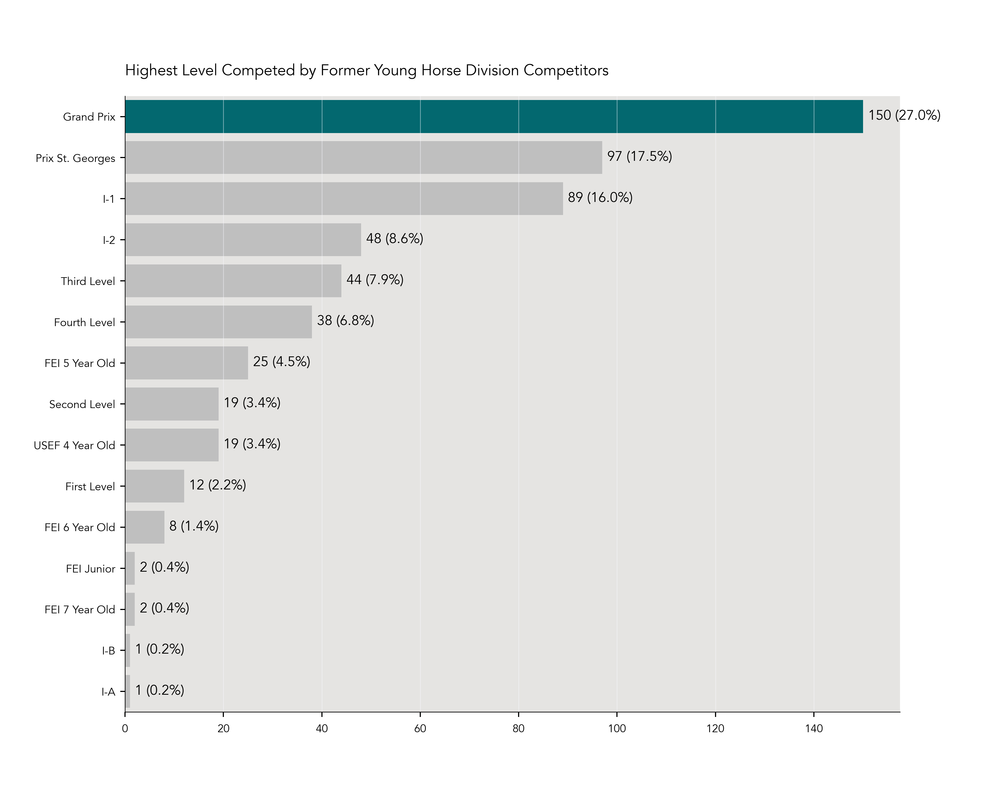
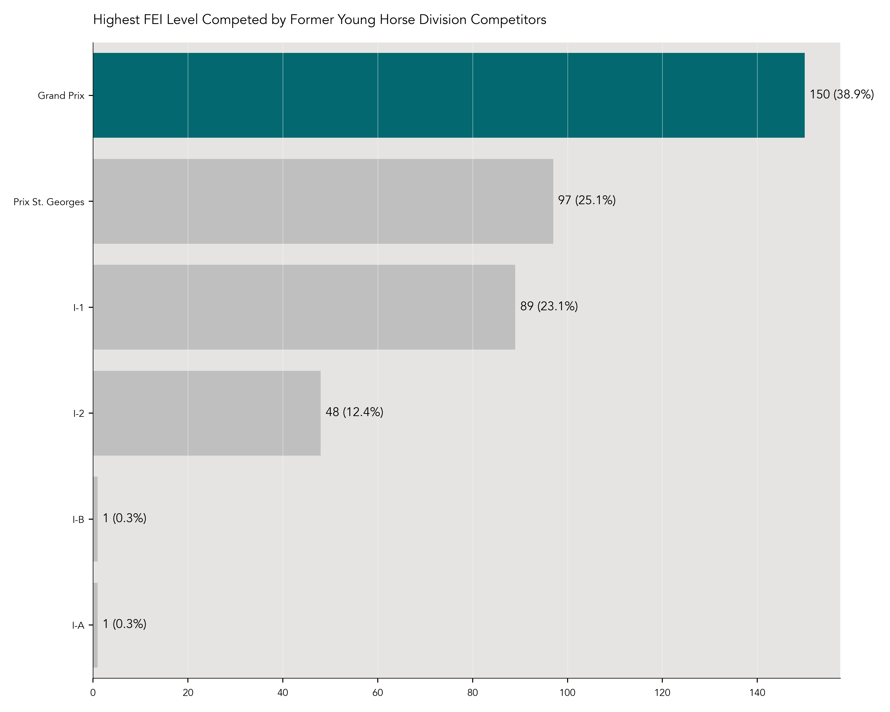
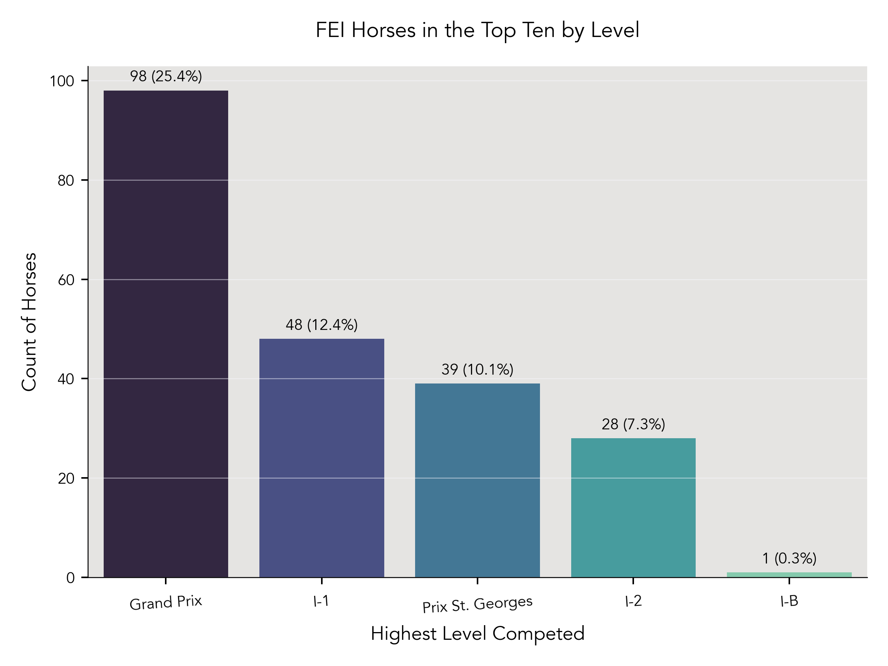
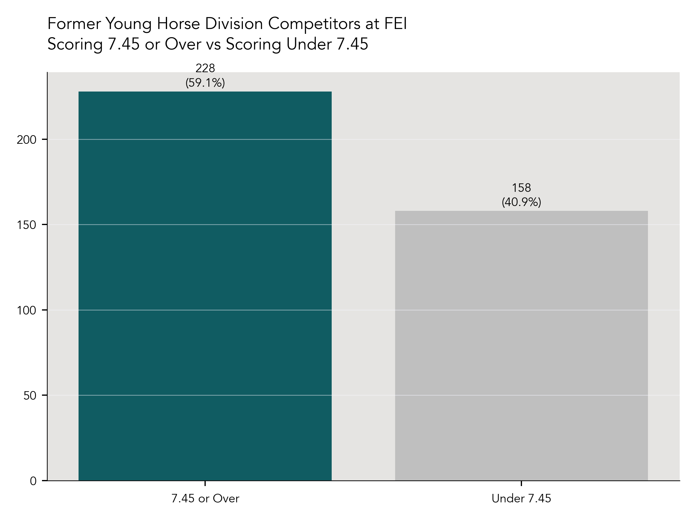
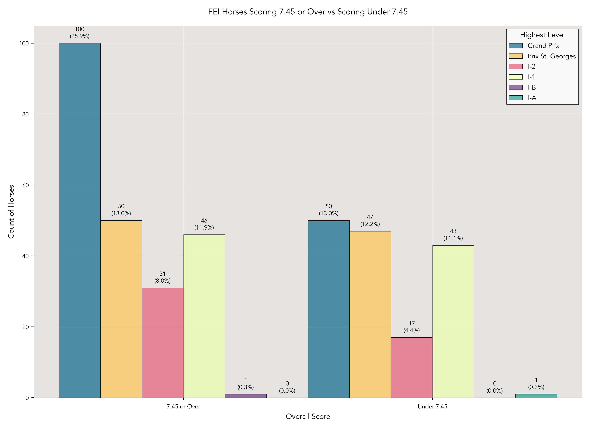
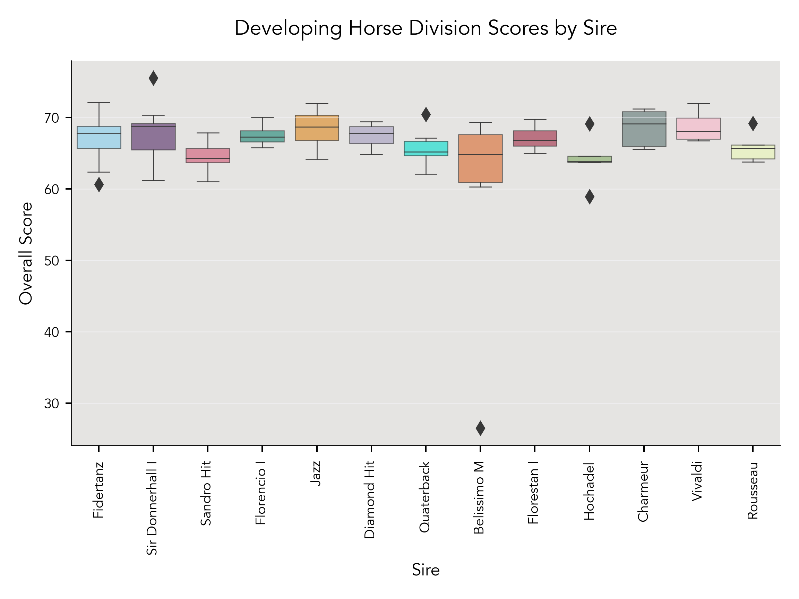
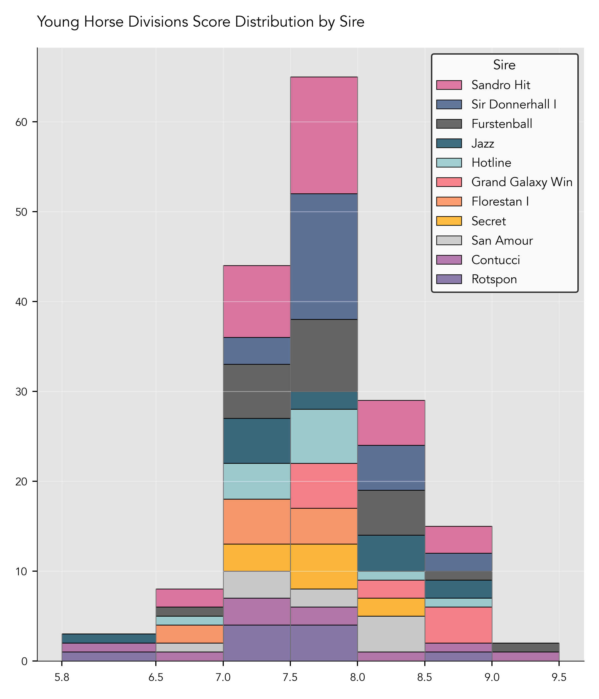
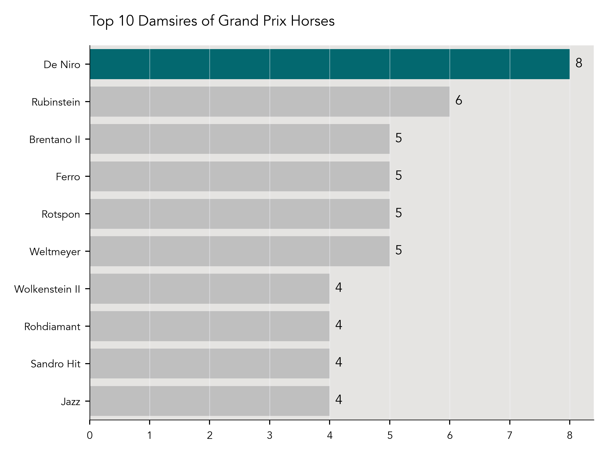

# Markel/USEF Young and Developing Dressage Horse Championship Data Analysis

## Introduction
The aim of this project is to analyze data from the USEF Young and Developing Horse Championships over the years. These championships, which for many years now have taken place at Lamplight Equestrian Center in Wayne, Illinois, are designed to aid in identifying horses that have the ability to compete at the FEI levels and be potential international competitors for the USA. The Young Horse divisions can be particularly divisive—some claim that horses that participate in these divisions end up washing out, or that many do not make it to the FEI level. Since we now have more than 20 years of data from these championships, I decided to look into these claims by analyzing the competitive careers of horses that participated. 

My aim is to update this project at the end of each competition season. 

Questions, comments, corrections, or suggestions for further areas of exploration are welcome—[contact me by email](byrne.sio@gmail.com).

## Data Acquisition and Cleaning
The current format of the competition for all divisions (4/5/6/7 Year Old, Developing Prix St. Georges, and Developing Grand Prix) involves two rounds, with round one counting for 40% of the overall score, and round two counting for 60% of the overall score. Overall scores determine the final placings. For the Young Horse divisions, 4 Year Olds ride the USEF Four Year Old test both times—in early years of the championships, round one was optional, and final placings were based solely on round two. The FEI 5, 6, and 7 Year Olds ride the Preliminary test in round one, and the Final test in round two. Developing Prix St. Georges horses ride the FEI Prix St. Georges in round one, and the USEF Developing Prix St. Georges test in round two. Developing Grand Prix horses ride the FEI Intermediate-2 test in round one, and the USEF Developing Grand Prix test in round two.

To complicate matters, early years of this program invited more horses to participate, and held both Final and Consolation Final rounds. To simplify this analysis, I did not include any Consolation Final results. 

For more recent years of the competition (2021-2023), the competition software system [Equestrian Hub](www.equestrian-hub.com) has automatically calculated these placings, which made it easy to obtain the data. For prior years, varying levels of detective work were required. I was able to find official overall placing records for some years on the United States Equestrian Federation (USEF) [website](www.usef.org/), but not all were available. For the years that had only the scores from each class available, I wrote a small program in Python to take each individual round of scores, and calculate the overall score using the 40/60 formula (available in the 'resources' folder for this project). While I have endeavored to do this without error, the lack of official overall rankings to compare to means that there may be errors involved as to exact overall placings of some horses. If you come across an error, [please contact me](byrne.sio@gmail.com) and I will make the correction.

Next, I looked up each horse in the United States Dressage Federation (USDF) [database](www.usdf.org/usdfscores), to determine a) what is the highest level to which this horse competed?,  and b) did this horse ever compete at the CDI (international) level? For a), I did not consider scores received—I was only concerned if that horse had a test on its record at that level. Therefore, this analysis does not differentiate between high and low scoring horses at any level. For b), I only considered horses to be CDI competitors if they had competed at a CDI at a level OTHER THAN the FEI Young Horse tests for 5, 6, and 7 Year Olds. 

I had the most difficulty acquiring the data on bloodlines and breeders, ironically. Because so many people fail to include this information on entry forms, lots of the data was incomplete. USEF does have a horse search function on their website, but they only list sire and dam (no damsire), and frequently the breeder and country of birth are left out. The USDF database also has frequently incomplete pedigree and breeder data. Finding this information required a lot of detective work in some cases, frequently utilizing [Horse Telex](www.horsetelex.com), a pedigree database. I also utilized old [Eurodressage](www.eurodressage.com) and [DressageDaily](www.dressagedaily.com) articles about various years of the championships. 

## Analysis Overview
I collected data on competitors from all years the championships have been held, 2002-2023, and all divisions (*N*=841). 

For the analysis of competitve careers of participants, I narrowed my focus to horses that competed in the USEF 4 Year Old, FEI 5 Year Old, and FEI 6 Year Old dvisions from 2002-2019 (*n*=520). Horses that competed in the USEF 4 Year Old division in 2019 would be 8 in 2023, and 8 is the youngest age a horse is allowed to compete at the highest of the FEI levels, Grand Prix. While it is rare to see a horse competing at that level at that age, it is legal, so I went with the lowest legal age to compete at Grand Prix versus the more common lowest age (9-10 years old). 

The analysis of bloodlines and other breeding data will look at all years of the program, 2002-2023, and all Young and Developing Horse divisons (*N*=841). 

### 2002 - 2019, 4/5/6 Year Old Division Competitive Outcomes

#### Highest Level of Competition Achieved
Figure 1 below shows the breakdown of the highest level achieved in competition by the horses that competed in the USEF Four Year Old, FEI 5 Year Old, and FEI 6 Year Old divisions from 2002-2019 (*n*=520). 26.4% (137/520) competed to Grand Prix, 17.9% (93/520) Prix St. Georges, 16.2% (84/520) Intermediate-1, 8.5% (44/520) Intermediate-2, 8.3% (43/520) Fourth Level, 7.5% (39/520) Third Level, 4% (21/520) FEI 5 Year Old, 3.7% (19/520) Second Level, 3.1% (16/520) USEF 4 Year Old, 2.1% (11/520) First Level, 1.2% (6/520) FEI 6 Year Old, 0.4% (2/520) FEI Junior, 0.4% (2/520) Intermediate-A, 0.4% (2/520) FEI 7 Year Old, 0.2% (1/520) Intermediate-B.  

*Figure 1: Breakdown of the highest level of competition achieved*

#### FEI Level Competitive Outcomes
Do horses that compete in the 4, 5, and 6 Year Old divisions make it to the FEI (Fédération Equestre Internationale) levels? 

To answer this question, I looked at the  competitive record of each of the 520 horses and considered them to have competed at FEI if they competed at any FEI level other than the FEI Young Horse divisions, at either a national show or a CDI (international competition). Those levels are comprised of Junior, Young Rider, Prix St. Georges, Intermediate-1 (I-1), Intermediate-A (I-A), Intermediate-B (I-B), Intermediate-2 (I-2), and Grand Prix. 

The overwhelming majority, 69.8% (363/520), made it to FEI. 21.5% (112/520) competed at the USEF levels (Training, First, Second, Third, Fourth). Only 8.7% (45/520) never competed at any level other than a Young Horse division (Figure 2). 

*Figure 2: FEI vs Non-FEI Horses*

Figure 3 below shows the level breakdown of horses that made it to FEI (*n*=363). 37.7% (137/363) of them competed to Grand Prix. 25.6% (93/363) competed to Prix St. Georges, 23.1% (84/363) I-1, 12.1% (44/363) I-2, 0.6% (2/363) FEI Junior, 0.6% (2/363) I-A, 0.3% (1/363) I-B. 

*Figure 3: Breakdown by level of horses that competed at FEI*

#### CDI Level Competitive Outcomes
Of the horses that made it to FEI (*n*=363), how many competed at the CDI (Concours de Dressage International) level? A CDI is an international competition sanctioned by the governing body for equestrian sports, the FEI (Fédération Equestre Internationale).  

The majority of horses, 53.4% (194/363), never competed in a CDI. Most horses, even if they make it to FEI, would not necessarily be competitive on the CDI level. CDI competitions are also much more expensive and complicated to enter and compete in (higher entry fees, horses must have an FEI passport). Finally, there are simply not that many CDI competitions in the USA, and the ones there are tend to be concentrated in certain areas, requiring long travel times for people in many parts of the country. 

46.6% (169/363) participated in at least one CDI at any level other than a Young Horse division (Figure 4).

*Figure 4: CDI vs Non-CDI Competitors*

#### Top Ten vs Lower Placing Horses
Are horses placing in the top ten versus lower placing horses (11 and under) more likely to make it to FEI? To answer this question, I looked at the overall placings and highest level competed of the horses that made it to the FEI levels (*n*=363). Because some horses competed at the championships multiple years and placed in the top ten one year but not another, I considered a horse to be in the top ten group if it made top ten at least once. 

The data shows a strong correlation between placing and FEI achievement: 77.1% (280/383) of horses that made it to the FEI levels placed in the top ten of their division at the championships, versus 22.9% (83/363) in the 11 and under placing group (Figure 5).

*Figure 5: Percentage of FEI Horses in Top Ten vs 11 and Under*

*Figure 6: Percentage of FEI Horses in Top Ten by Level*

When we look at horses that competed to Grand Prix (*n*=137), the correlation between a top ten placing and level achievment is even more impressive: 90.5% (124/137) of the horses that made it to Grand Prix placed in the top ten of their division, versus a mere 9.5% (13/137) in the 11 and under placing group (Figure 7). 

*Figure 7: Grand Prix horses by placing at Championships*

This finding may be influenced by the years this project is analyzing. In the early years of this program, there were frequently 10 or fewer horses in some divisions. It is also possible that the quality of horse that places in the top ten is more likely to be ridden and trained by more experienced individuals, which may up their odds of making it to the higher levels. It will be interesting to see how/if this number changes, as more years of data are added to this analysis.

#### Overall Score and FEI Achievement
Does a higher overall score make it more likely that a horse makes it to FEI? To answer this question, I separated FEI horses (*n*=363) into two categories, those that had an overall score of 7.5 or above, and those that scored below that threshold. As with the analysis on placings, if a horse competed at the championships more than once, I considered them to be in the 7.5 and above group as long as one of their scores met that criteria. 

The data did show a correlation between overall score and a horse making it to the FEI levels. 56.2% of horses (204/363) that made it to FEI achieved an overall score of 7.5 or above, compared to 43.8% (159/363) that scored below 7.5 (Figure 8). 

*Figure 8: FEI Horses Scoring 7.5 or Above vs Below 7.5*

When we look at this by level, interestingly, the numbers are fairly close for most levels.The equal to or over/under split is 43.2% (43/93) and 53.8% (50/93) for Prix St. Georges, 47.6% (40/84) and 52.4% (44/84) for I-1. FEI Junior/I-A/I-B have too few data points for useful analysis (2 or fewer horses at each level). However, at I-2 and Grand Prix a clear majority of horses, 63.6% (28/44) that made it to I-2 and 66.9% (91/137) that made it to Grand Prix had an overall score of 7.5 or above (Figure 9). 

*Figure 9: FEI Horses Scoring 7.5 or Above vs Below 7.5 by Level*

#### International Team Horses
As one aim of these championships is to help identify horses that may be potential international team horses, I wanted to see how many horses from this time period (*N*=520)went on to represent the USA (or any other country) on a team in a major championship. I defined this as being named a member of a Pan American Games, World Equestrian Games, or Olympic Games team. 

Four horses from this time period, 0.8% (4/520) of the sample, went on to make international teams. These horses were Grandioso (Pan American Games, for the United States), Lucky Strike (named to Pan American Games team for the United States, but did not compete due to injury during transport), Selten HW (Olympic Games, for Denmark), and Sanceo (Pan American and Olympic Games, for the United States).

While this is clearly a very small number, I would argue that it is still impressive. 

| Horse        | Sire        | Damsire         | Country Bred   | Breeder                   | Studbook   | Team Made                            |
|:-------------|:------------|:----------------|:---------------|:--------------------------|:-----------|:-------------------------------------|
| Grandioso    | Grosso Z    | Palisandergrund | Germany        | Willi Hillebrecht         | Westfalen  | Pan American Games                   |
| Selten HW    | Sandro Hit  | Hohenstein      | USA            | Irene Hoeflich-Wiederhold | Hanoverian | Olympic Games                        |
| Sanceo       | San Remo    | Ramiro's Son II | Germany        | Gerhard Dustmann          | Hanoverian | Olympic Games and Pan American Games |
| Lucky Strike | Lord Laurie | His Highness    | Germany        | Monika Hartwitch          | Hanoverian | Pan American Games                   |

### 2002 - 2023, Overall Scores Analysis
I wanted to look at overall scores over the years, to see if there was a relationship between year and overall score. My hypothesis was that scores would have a positive trend over time, as both breeding and training of horses has improved over the years. I did not include the FEI 7 Year Old division in this analysis, as this division has only been offered since 2022, and therefore does not have many data points, as seen in the summary table below.

| Division   |   Number of Scores |   Mean Score |   Median Score |   Standard Deviation |   Variance |
|:-----------|-------------------:|-------------:|---------------:|---------------------:|-----------:|
| DHGP       |                121 |     64.1928  |        64.888  |             6.62417  |  43.8796   |
| DHPSG      |                241 |     66.4908  |        67.339  |             5.70654  |  32.5646   |
| FEI5       |                291 |      7.53029 |         7.584  |             0.8725   |   0.761256 |
| FEI6       |                276 |      7.37784 |         7.504  |             1.012    |   1.02415  |
| FEI7       |                 28 |     70.6219  |        71.3295 |             8.93975  |  79.9191   |
| USEF4      |                267 |      7.59232 |         7.62   |             0.801735 |   0.642779 |

The standard deviation for each the Young Horse divisions (4/5/6 Year Olds) is much smaller than that of the Developing Horse divisions, which makes sense given the way the scoring for these tests differs from regular dressage tests. Young Horse tests are scored by giving a numerical score from 1-10 (the score can utilize decimals, e.g. 7.5, 8.2) for the walk, trot, canter, submission, and perspective. The marks are added and then multiplied by 2. The final score is expressed as a number, not a percentage, so the decimal point is moved to the left by one place. [See the FEI 5 Year Old Final test for an example](https://inside.fei.org/system/files/Young%20Horses%205%20YO%20Final%202022.pdf). For instance, a horse given a 8.1 on the walk, 7.5 on the trot, 7.9 on the canter, 7.3 on submission and 7.7 on perspective would receive an overall score of 77, which would be reported as a score of 7.7. Other than the occasional lower score on submission, it is rare for individual scores to be below 6 at the championships. In order to compete at championships, there is a minimum qualifying score (for the 2024 championships, horses must have an overall average of 7.5). So the overall quality of horse, combined with the scoring method, results in very small numbers for both standard deviation and variance. 

In contrast, the Developing Horse tests are scored by movement, and each test has 26-28 individually scored movements. The number of points earned is then used to calculate the final score by percentage, e.g. 66.75%. [See the USEF Developing Prix St. Georges test for an example](https://www.usdf.org/docs/showflash/web/tests/2023/2023%20Developing%20Horse%20Prix%20St%20George.pdf?t=7/8/2024%207:36:58%20PM).

#### Methodology

For each division, my first step was to find the upper and lower quantiles, and calculate the IQR. I used a box and whisker plot to visualize the data and outliers. 

After the outliers were identified, I made the decision to drop only the outliers that were artificially low due to missing half of a score. Because the overall score is a weighted calculation (scores are worth 40% on day one, 60% on day two) of scores from two different days, a horse that either got eliminated or had to withdraw from one day will have an artificially low overall score. All other scores were retained. 

I then created a scatterplot from the remaining scores, performed a linear regression on the data, and calculated the Pearson correlation coefficient and *P* value. 
 

#### USEF 4 Year Old Scores Analysis

*Figure 10: Box and whisker plot for the USEF 4 Year Old Division Scores*

From the box and whisker plot of all of the scores, I was able to identify the following outliers:

|      |   Year | Division   |   OverallScore |
|-----:|-------:|:-----------|:---------------|
|  176 |   2007 | USEF4      |          5.94  |
|  525 |   2013 | USEF4      |          2.792 |
|  717 |   2016 | USEF4      |          3.048 |
| 1128 |   2022 | USEF4      |          9.292 |
| 1140 |   2022 | USEF4      |          2.976 |
| 1223 |   2023 | USEF4      |          2.904 |

Four of the six outliers (all scores below 5.94) were due to the horse completing only one half of the competition, and were dropped. Linear regression was performed on the rest of the data (Figure 11). 

*Figure 11: Scatterplot and linear regression for the USEF 4 Year Old Division Scores*

While the correlation coefficient is weak (0.39), there is a statistically significant *P* value (*P*<.001). 

#### FEI 5 Year Old Scores Analysis

*Figure 12: Box and whisker plot for the FEI 5 Year Old Division Scores*

From the box and whisker plot of all of the scores, I was able to identify the following outliers:

|      |   Year | Division   |   OverallScore |
|-----:|-------:|:-----------|:---------------|
|   14 |   2004 | FEI5       |          9.14  |
|   30 |   2004 | FEI5       |          6.22  |
|   31 |   2004 | FEI5       |          5.94  |
|  328 |   2010 | FEI5       |          4.56  |
|  373 |   2011 | FEI5       |          3.112 |
|  500 |   2013 | FEI5       |          9.012 |
|  770 |   2017 | FEI5       |          2.904 |
|  901 |   2019 | FEI5       |          9.056 |
|  914 |   2019 | FEI5       |          3.016 |
|  982 |   2020 | FEI5       |          2.944 |
| 1039 |   2021 | FEI5       |          9.518 |
| 1040 |   2021 | FEI5       |          8.964 |
| 1115 |   2022 | FEI5       |          9.248 |
| 1206 |   2023 | FEI5       |          3.432 |
| 1207 |   2023 | FEI5       |          3.144 |

7 of the 15 outliers (all scores below 5.94) were due to the horse completing only one half of the competition, and were dropped.  Linear regression was performed on the rest of the data (Figure 13).

*Figure 13: Scatterplot and linear regression for the FEI 5 Year Old Division Scores*

#### FEI 6 Year Old Scores Analysis

*Figure 14: Box and whisker plot for the FEI 6 Year Old Division Scores*

From the box and whisker plot of all of the scores, I was able to identify the following outliers:

|      |   Year | Division   |   OverallScore |
|-----:|-------:|:-----------|:---------------|
|   46 |   2004 | FEI6       |          5.8   |
|  156 |   2007 | FEI6       |          2.808 |
|  261 |   2009 | FEI6       |          2.744 |
|  262 |   2009 | FEI6       |          2.424 |
|  488 |   2013 | FEI6       |          9.152 |
|  561 |   2014 | FEI6       |          2.904 |
|  689 |   2016 | FEI6       |          2.888 |
|  690 |   2016 | FEI6       |          2.856 |
|  826 |   2018 | FEI6       |          2.92  |
| 1190 |   2023 | FEI6       |          4.668 |
| 1191 |   2023 | FEI6       |          3.064 |
| 1192 |   2023 | FEI6       |          2.912 |

10 of the 12 outliers (all scores below 5.8) were due to the horse completing only one half of the competition, and were dropped. Linear regression was performed on the rest of the data (Figure 15).

*Figure 15: Scatterplot and linear regression for the FEI 6 Year Old Division Scores*

#### Developing Prix St. Georges Scores Analysis

*Figure 16: Box and whisker plot for the Developing Prix St. Georges Division Scores*

From the box and whisker plot of all of the scores, I was able to identify the following outliers:

|      |   Year | Division   |   OverallScore |
|-----:|-------:|:-----------|:---------------|
|  193 |   2008 | DHPSG      |         55.913 |
|  249 |   2009 | DHPSG      |         58.45  |
|  533 |   2014 | DHPSG      |         76.515 |
| 1023 |   2021 | DHPSG      |         26.509 |
| 1024 |   2021 | DHPSG      |         26.49  |
| 1161 |   2023 | DHPSG      |         43.333 |
| 1162 |   2023 | DHPSG      |         39.778 |
| 1163 |   2023 | DHPSG      |         38.361 |

Five of the eight outliers (all scores below 55%) were due to the horse completing only one half of the competition, and were dropped.  Linear regression was performed on the rest of the data (Figure 17).

*Figure 17: Scatterplot and linear regression for the Developing Prix St. Georges Division Scores*

#### Developing Grand Prix Scores Analysis

*Figure 18: Box and whisker plot for the Developing Grand Prix Division Scores*

From the box and whisker plot of all of the scores, I was able to identify the following outliers:

|      |   Year | Division   |   OverallScore |
|-----:|-------:|:-----------|:---------------|
|  412 |   2012 | DHGP       |         54.271 |
|  473 |   2013 | DHGP       |         56.649 |
|  869 |   2019 | DHGP       |         25.666 |
|  870 |   2019 | DHGP       |         23.254 |
|  998 |   2021 | DHGP       |         75.519 |
| 1150 |   2023 | DHGP       |         56.128 |
| 1151 |   2023 | DHGP       |         38.75  |

Three of the seven outliers (all scores below 54%) were due to the horse completing only one half of the competition, and were dropped.  Linear regression was performed on the rest of the data (Figure 19).

*Figure 19: Scatterplot and linear regression for the Developing Grand Prix Division Scores*

### 2002 - 2023, All Divisions (4/5/6 Year Old, Developing Prix St. Georges, Developing Grand Prix) Breeding and Bloodlines Analysis

### Analysis of Scores by Sire 
Because the scoring format for the 4/5/6 Year Old divisions is different than the scoring format for the Developing Horse divisions, I broke out the analysis of scores by sire out into two different groups. I included only stallions with 8 or more offspring, in order to have a better sample size (although clearly, the sample sizes are not that large regardless). 

#### Summary Statistics for Scores by Sire, Young Horse Divisions 
The sire with the highest median score in the Young Horse divisions is Belissimo M (8.208). Close behind is Grand Galaxy Win, with a median score of 8.154. 

| Sire             |   Number of Scores |   Mean Score |   Median Score |   Standard Deviation |   Variance |
|:-----------------|-------------------:|-------------:|---------------:|---------------------:|-----------:|
| Apache           |                  9 |      7.65533 |          7.708 |             0.528117 |   0.278908 |
| Belissimo M      |                  8 |      8.062   |          8.208 |             0.594854 |   0.353851 |
| Contucci         |                 10 |      7.628   |          7.452 |             0.81952  |   0.671612 |
| Florencio I      |                  8 |      7.50625 |          7.536 |             0.609313 |   0.371262 |
| Florestan I      |                 11 |      7.369   |          7.4   |             0.385015 |   0.148237 |
| Furstenball      |                 21 |      7.8301  |          7.72  |             0.56074  |   0.31443  |
| Grand Galaxy Win |                 11 |      8.27773 |          8.154 |             0.569092 |   0.323866 |
| Hotline          |                 13 |      7.62323 |          7.58  |             0.502625 |   0.252632 |
| Idocus           |                  8 |      7.702   |          7.56  |             0.831318 |   0.69109  |
| Jazz             |                 14 |      7.764   |          7.758 |             0.722566 |   0.522102 |
| Quaterback       |                  8 |      7.6075  |          7.616 |             0.631752 |   0.399111 |
| Rotspon          |                 10 |      7.5211  |          7.486 |             0.708312 |   0.501706 |
| San Amour        |                  9 |      7.63511 |          7.552 |             0.48282  |   0.233115 |
| Sandro Hit       |                 31 |      7.68797 |          7.636 |             0.525052 |   0.27568  |
| Sir Donnerhall I |                 24 |      7.80379 |          7.718 |             0.382872 |   0.146591 |
| Sir Sinclair     |                  9 |      7.66511 |          7.68  |             0.423529 |   0.179377 |

*Figure 20: Boxplot of Young Horse Divisions Scores by Sire*

#### Summary Statistics for Scores by Sire, Developing Horse Divisions
The sire with the highest median score in the Developing Horse divisions is Wagnis (69.919%). Runner up is Charmeur (69.152%). 

| Sire             |   Number of Scores |   Mean Score |   Median Score |   Standard Deviation |   Variance |
|:-----------------|-------------------:|-------------:|---------------:|---------------------:|-----------:|
| Ampere           |                  4 |      68.3042 |        68.3415 |              2.25245 |    5.07352 |
| Belissimo M      |                  4 |      65.0897 |        65.386  |              4.22503 |   17.8509  |
| Charmeur         |                  5 |      68.5348 |        69.152  |              2.66971 |    7.12733 |
| Contucci         |                  4 |      64.845  |        63.0985 |              6.00224 |   36.0269  |
| Diamond Hit      |                  7 |      67.4623 |        67.774  |              1.72814 |    2.98647 |
| Don Schufro      |                  4 |      65.5627 |        65.278  |              1.60009 |    2.56028 |
| Fidertanz        |                 13 |      67.2732 |        67.807  |              3.24802 |   10.5496  |
| Florencio I      |                  7 |      67.5287 |        67.306  |              1.43564 |    2.06105 |
| Florestan I      |                  6 |      67.1293 |        66.8035 |              1.75294 |    3.07282 |
| Hochadel         |                  5 |      64.0688 |        63.885  |              3.61994 |   13.104   |
| Jazz             |                  7 |      68.4527 |        68.705  |              2.76839 |    7.66396 |
| Johnson          |                  4 |      64.595  |        64.8145 |              1.76534 |    3.11644 |
| Quaterback       |                  6 |      65.7647 |        65.201  |              2.79883 |    7.83345 |
| Romanov          |                  4 |      66.7168 |        66.3945 |              3.42845 |   11.7542  |
| Rotspon          |                  4 |      67.33   |        66.197  |              2.99827 |    8.98964 |
| Rousseau         |                  5 |      65.8092 |        65.67   |              2.13535 |    4.55973 |
| Sandro Hit       |                  9 |      64.6292 |        64.273  |              2.26267 |    5.11968 |
| Sir Donnerhall I |                 10 |      67.8955 |        68.7305 |              3.90009 |   15.2107  |
| UB 40            |                  4 |      66.8538 |        66.955  |              1.20529 |    1.45272 |
| Vivaldi          |                  4 |      69.191  |        68.997  |              2.28054 |    5.20086 |
| Wagnis           |                  4 |      71.1148 |        69.919  |              2.80298 |    7.85668 |

*Figure 21: Boxplot of Developing Horse Divisions Scores by Sire*

#### Distribution of Scores by Sire, Young Horse Division

*Figure 22: Histogram of Young Horse Divisions Scores by Sire*

#### Distribution of Scores by Sire, Developing Horse Division

*Figure 23: Histogram of Developing Horse Divisions Scores by Sire*

#### US-Bred vs All Other Countries
Far more horses participating in the championships are foreign-bred than bred in the USA (Figure 24). 307 horses were bred in the USA (36.5%), with 526 (63.15%) bred in all other countries. Why are there so many more foreign-bred horses than US-bred horses? There are many possible explanations:

* Many people shop for horses in Europe because it is easier to see many horses in one location versus the USA, where one can spend a lot of money traveling across the country to look at only one or two horses
* Depending on the exchange rate, it may be advantageous cost-wise to buy from other countries, as breeders in the USA face much higher costs to produce and raise foals
* European countries produce far more warmblood foals than the USA
* Bias against American breeders—some may think American-bred foals aren't as good as those produced in Europe
* Hard to get top American-bred foals into the hands of riders that can develop them to Grand Prix
* USA lacks a well-developed pipeline from foal to young horse to FEI
* More young horse specialists in Europe makes it easier for buyers who may not have access to a good young horse specialist in their part of the USA

*Figure 24: Horses by Country Bred*

#### Top Ten Sires Represented by Offspring Count
Figure 25 below shows the top ten sires of championship competitors by number of offspring. The stallion with the most offspring competing was Sandro Hit (24). The rest of the top ten were Sir Donnerhall I (18), Furstenball (17), Jazz (13), Rotspon (12), Fidertanz (12), Florestan I (11), Hotline (10), Grand Galaxy Win (9), Florencio I (9), and Sir Sinclair (9). The three-way tie for ninth place in the top ten means there are actually eleven sires represented in this chart.

*Figure 25: Top Ten Sires by Number of Offspring*

#### Top Ten Damsires Represented by Offspring Count
Figure 26 below shows the top ten damsires of championship competitors by number of offspring. The damsire with the most offspring competing was Rubinstein (25). The rest of the top ten were De Niro (18), Sandro Hit (17), Jazz (16), Rotspon (16), Weltmeyer (14), Ferro (13), Krack C (11), Sir Donnerhall I (11), and Rohdiamant (11). 

This column had the second most null values of all the columns (18 missing values / 3.5% of the total)—I hope to resolve this in future iterations of this project.

*Figure 26: Top Ten Damsires by Number of Offspring*

#### Top Ten Sires of Grand Prix Horses by Offspring Count
The top sire of Grand Prix horses was also Sandro Hit (12). The rest of the top ten were Jazz (8), Sir Donnerhall I (7), Florestan I (5), Florencio I (5), Rotspon (4), Fidertanz (4), and 3 each for Furstenball, Sir Sinclair, San Amour, Hotline, Gribaldi, and Contango. 

*Figure 27: Top Ten Grand Prix Sires by Number of Offspring*

#### Highest Percentage of Grand Prix Horses by Sire
When looking at the highest percentage of Grand Prix offspring, I only looked at sires with 5 or more offspring total, in order to have a better sample size (although this is obviously still quite small). When we look at sires of Grand Prix offspring by the highest percentage versus solely looking at the count, it shakes things up a bit.

The top producer of Grand Prix horses by percentage was Quaterback, who had 4 out of 6 offspring at Grand Prix (66.67%). Jazz maintained his second place spot, with 8 out of 13 offspring at Grand Prix (61.54%). While Sandro Hit had the highest number of Grand Prix offspring at 12, this was only 50% of the total number of offspring. 

*Figure 28: Percentage of Grand Prix Offspring by Sire*

#### Top Ten Damsires of Grand Prix Horses by Offspring Count
The top damsire of Grand Prix horses was De Niro (7). The rest of the top ten were Rubinstein (6), Rotspon (6), Ferro (5), Weltmeyer (4), Rohdiamant (4), Jazz (4), Sandro Hit (3), Sir Donnerhall (1), and Krack C (1). 

Once again, the prevalence of null values (just over 3.5%) in the damsire column affects the completeness of this data. 

*Figure 29: Top Ten Grand Prix Damsires by Number of Offspring*

#### Highest Percentage of Grand Prix Horses by Damsire
There was a similar shakeup when I looked at the percentage of Grand Prix offspring by damsire (Figure 30). While Brentano II was ranked fourth by number of Grand Prix offspring by count, when we look at the percentage of Grand Prix offspring, he jumps to first, with 100% of offspring (5/5) competing to Grand Prix. Davignon I and Don Schufro shared the second place spot with 50% (3/6 for both). While Sandro Hit was in the top three in terms of number of offspring of which he was the damsire, only 17.7% (3/17) of those were Grand Prix horses.

*Figure 30: Percentage of Grand Prix Offspring by Damsire*

#### Top Ten Most Prominent Breeders by Horse Count
The most prominent breeder over all years and divions is DG Bar Ranch (USA), with 16 horses. The rest of the top ten were Maryanna Haymon (USA, 12 horses), Nancy Holowesko (USA, 9 horses), Leatherdale Farms (USA, 7 horses), Oak Hill Ranch (USA, 6 horses), Judy Yancey (USA, 6 horses), Horses Unlimited (USA, 6 horses), Gestut Lewitz (Germany, 6 horses), Maurine Swanson (USA, 5 horses), and Jackie Ahl-Eckhaus (USA, 5 horses). 

This column had the most null values overall—47 missing values, which equates to 9% of the total. This data was also frequently extremely difficult to track down. While making submission of registration papers a condition for a USEF/USDF number may not be practical for a variety of reasons, it would help American sporthorse breeding to make this data easily available. Breeders also clearly deserve recognition for the essential role they play in the development of the modern sporthorse. 

*Figure 31: Top Ten Most Prominent Breeders by Number of Horses*

#### Top Ten Studbooks by Horse Count
In order to compete at these championships, all horses must be registered with a studbook recognized by the World Breeding Federation for Sport Horses (WBFSH), or a national breed registry such as Jockey Club (the national registry for Thoroughbreds). Warmbloods are not really a breed (the Trakhener being an exception), they are a type. While there is definitly a lot of crossover in bloodlines through all the warmblood studbooks, each has their own directives and requirements for approval of mares and stallions, and the registration of offspring. I was curious to see what the most represented studbooks were, so I calculated the number of horses attributed to each (Figure 32) from the database of championship competitors over all years of the program (*N*=841). The studbook with the most horses competing over all years was KWPN (Koninklijk Warmbloed Paardenstamboek Nederland, also known as Dutch Warmblood), with 29% (244/841). The Hanoverian studbook was a close second, with 28.7% (241/841). 

Oldenburg was third, with 21.9% (184/841). There was sometimes considerable difficulty in differentiating horses that were truly in the official German Oldenburg studbook (Oldenburg Horse Breeders Society/GOV, which is also just referred to as Oldenburg by some), and horses registered with Oldenburg NA (an American studbook no longer affiliated with the German studbook but was at one point the official American branch, also often just referred to as Oldenburg). Because of this, all horses that were listed as bring registered Oldenburg are combined. 

The rest of the top ten were Westfalen 5.7% (48/841), Danish Warmblood 4% (34/841) , Rhinelander 2.1% (18/841), American Warmblood 1.2% (10/841), Pura Raza Espanola (PRE) 0.8% (7/841), Holsteiner 0.8% (7/841), and Swedish Warmblood 0.7% (6/841). 

It makes sense that KWPN, Hanoverian, and Oldenburg are the most dominant studbooks, as they have by far the biggest presence in the United States. The American branch of the KWPN, KWPN-NA, [states on their website](https://kwpn-na.org/the-kwpn-na/about/about-kwpn-na/) they have registered an average of more than 550 foals a year over the last decade. 

*Figure 32: Top Ten Most Prominent Studbooks by Number of Horses*

#### Most Championship Appearances
The horse with the most appearances at the Markel/USEF Young and Developing Horse Championships to date is WakeUp, ridden by Emily Miles. WakeUp competed in the Four and Six Year Old Championships as a young horse, and represented the USA at the World Young Horse Championships in Verden, Germany as a 5 year old in 2010. 

He also competed two years in a row in both the Developing Prix St. Georges and Developing Grand Prix divisions, and went on to compete at the CDI level at Grand Prix. 

*Figure 33: Horses with Most Appearances at Championships*

## Final Thoughts
I am a dressage trainer and competitor myself, and an agnostic when it comes to the Young Horse program. There are horses who can handle the requirements of these tests without undue stress, and those whose development doesn't align with the requirements of the tests. Both types of horses can make it to FEI, and be successful. The tests themselves are not the problem, the real issue is the lack of consideration for where a horse is in their development. 

## Acknowledgements
The following sites were utilized to research this project and gather this data:

* [United States Dressage Federation (USDF)](www.usdf.org)
* [United States Equestrian Federation (USEF)](www.usef.org)
* [Equestrian Hub](www.equestrian-hub.com)
* [Fox Village](www.foxvillage.com)
* [Horse Telex](www.horsetelex.com)
* [Eurodressage](www.eurodressage.com)
* [DressageDaily](www.dressagedaily.com)