# Markel/USEF Young and Developing Dressage Horse Championship Data Analysis

## Introduction
The aim of this project is to analyze data from the USEF Young and Developing Horse Championships over the years. These championships, which for many years now have taken place at Lamplight Equestrian Center in Wayne, Illinois, are designed to aid in identifying horses that have the ability to compete at the FEI levels and be potential international competitors for the USA. The Young Horse divisions can be particularly divisive—some claim that horses that participate in these divisions end up washing out, or that many do not make it to the FEI level. Since we now have more than 20 years of data from these championships, I decided to look into these claims by analyzing the competitive careers of horses that participated. 

My aim is to update this project at the end of each competition season. 

Questions, comments, corrections, or suggestions for further areas of exploration are welcome—[contact me by email](byrne.sio@gmail.com).

## Data Acquisition and Cleaning
The current format of the competition for all divisions (4/5/6/7 Year Old, Developing Prix St. Georges, and Developing Grand Prix) involves two rounds, with round one counting for 40% of the overall score, and round two counting for 60% of the overall score. Overall scores determine the final placings. For the Young Horse divisions, 4 year olds ride the USEF 4 Year Old test both times—in early years of the championships, round one was optional, and final placings were based solely on round two. The FEI 5, 6, and 7 Year Olds ride the Preliminary test in round one, and the Final test in round two. Developing Prix St. Georges horses ride the FEI Prix St. Georges in round one, and the USEF Developing Prix St. Georges test in round two. Developing Grand Prix horses ride the FEI Intermediate-2 test in round one, and the USEF Developing Grand Prix test in round two.

To complicate matters, a few early years of this program invited more horses to participate, and held both Final and Consolation Final rounds. To simplify this analysis, I did not include any Consolation Final results. 

For more recent years of the competition (2021-2024), the competition software system [Equestrian Hub](www.equestrian-hub.com) has automatically calculated these placings, which made it easy to obtain the data. For prior years, varying levels of detective work were required. I was able to find official overall placing records for some years on the United States Equestrian Federation (USEF) [website](www.usef.org/), but not all were available. For the years that had only the scores from each class available, I wrote a [small program in Python](resources/yh-score-calculator.py) to take each individual round of scores, and calculate the overall score using the 40/60 formula. While I have endeavored to do this without error, the lack of official overall rankings to compare to means that there may be errors involved as to exact overall placings of some horses. If you come across an error, [please contact me](byrne.sio@gmail.com) and I will make the correction.

Next, I looked up each horse in the United States Dressage Federation (USDF) [database](www.usdf.org/usdfscores), to determine a) what is the highest level to which this horse competed?,  and b) did this horse ever compete at the CDI (international) level? For a), I did not consider scores received—I was only concerned if that horse had a test on its record at that level. Therefore, this analysis does not differentiate between high and low scoring horses at any level, nor does it address competitive career length. For b), I only considered horses to be CDI competitors if they had competed at a CDI at a level other than the FEI Young Horse tests for 5, 6, and 7 Year Olds, or the FEI divisions that are limited to youth competitors (Pony/Children/Junior/Young Rider/U-25). 

I had the most difficulty acquiring the data on bloodlines and breeders, ironically. Because so many people fail to include this information on entry forms, lots of the data was incomplete. USEF does have a horse search function on their website, but they only list sire and dam (no damsire), and frequently the breeder and country of birth are left out. The USDF database also has frequently incomplete pedigree and breeder data. Finding this information required a lot of detective work in some cases, frequently utilizing [Horse Telex](www.horsetelex.com), a pedigree database. I also utilized old [Eurodressage](www.eurodressage.com) and [DressageDaily](www.dressagedaily.com) articles about various years of the championships. 

## Analysis Overview
I collected data on competitors from all years the championships have been held, 2002-2024, and all divisions (*N*=888). 

For the analysis of competitve careers of Young Horse division participants, I narrowed my focus to horses that competed in the USEF 4 Year Old, FEI 5 Year Old, and FEI 6 Year Old dvisions from 2002-2020 (*n*=555). Horses that competed in the USEF 4 Year Old division in 2020 would be 8 in 2024, and 8 is the youngest age a horse is allowed to compete at the highest of the FEI levels, Grand Prix. While it is rare to see a horse competing at that level at that age, it is legal, so I went with the lowest legal age to compete at Grand Prix versus the more common lowest age (9-10 years old). I made the decision not to include the FEI 7 Year Old division in this analysis, as this division was only added in 2022 and therefore has limited data. I plan on adding this division to the analysis in the future. 

For the analysis of competitve careers of Developing Horse division participants, I focused on competitors in these divisions from 2008-2023 (*n*=283). Horses are eligible for the Developing Prix St. Georges from 7-9 years of age, so all participants from these years would be old enough in 2024 to legally compete at Grand Prix. Note that this analysis starts in 2008 instead of 2002 like the Young Horse division analysis, as the Developing Prix St. Georges division wasn't offered until that year. 

The analysis of bloodlines and other breeding data will look at all years of the program, 2002-2024, and all Young and Developing Horse divisons (*N*=888). 

### 2002 - 2020, Young Horse (4/5/6 Year Old) Division Competitive Outcomes

#### Highest Level of Competition Achieved by Young Horse Division Competitors
Figure 1 below shows the breakdown of the highest level achieved in competition by the horses that competed in the USEF 4 Year Old, FEI 5 Year Old, and FEI 6 Year Old divisions from 2002-2020 (*n*=555). 26.5% (147/555) competed to Grand Prix, 17.8% (99/555) Prix St. Georges, 16% (89/555) I-1, 8.8% (49/555) I-2, 7.9% (44/555) Third Level, 6.8% (38/555) Fourth Level, 4.5% (25/555) FEI 5 Year Old, 3.4% (19/555) Second Level, 3.4% (19/555) USEF 4 Year Old, 2.2% (12/555) First Level, 1.4% (8/555) FEI 6 Year Old, 0.4% (2/555) FEI Junior, 0.4% (2/555) FEI 7 Year Old, 0.2% (1/555) I-A, 0.2% (1/555) I-B.  

***Figure 1***  
*Breakdown of Highest Level of Competition Achieved by Former Young Horse Division Competitors*

#### FEI Level Competitive Outcomes for Young Horse Division Competitors
Do horses that compete in the 4, 5, and 6 Year Old divisions make it to the FEI (Fédération Equestre Internationale) levels? 

To answer this question, I looked at the  competitive record of each of the 555 horses and considered them to have competed at FEI if they competed at any FEI level other than the FEI Young Horse or the Pony/Children/Junior/Young Rider (eligibility limited by rider's age) divisions, at either a national show or a CDI (international competition). Those levels are comprised of Prix St. Georges, Intermediate-1 (I-1), Intermediate-A (I-A), Intermediate-B (I-B), Intermediate-2 (I-2), and Grand Prix. 

The overwhelming majority, 69.5% (386/555), made it to FEI. 20.7% (115/555) competed at the USEF levels (Training, First, Second, Third, Fourth). Only 9.7% (54/555) never competed at any level other than a Young Horse division (Figure 2). 

***Figure 2***  
*FEI vs Non-FEI Former Young Horse Division Competitors*
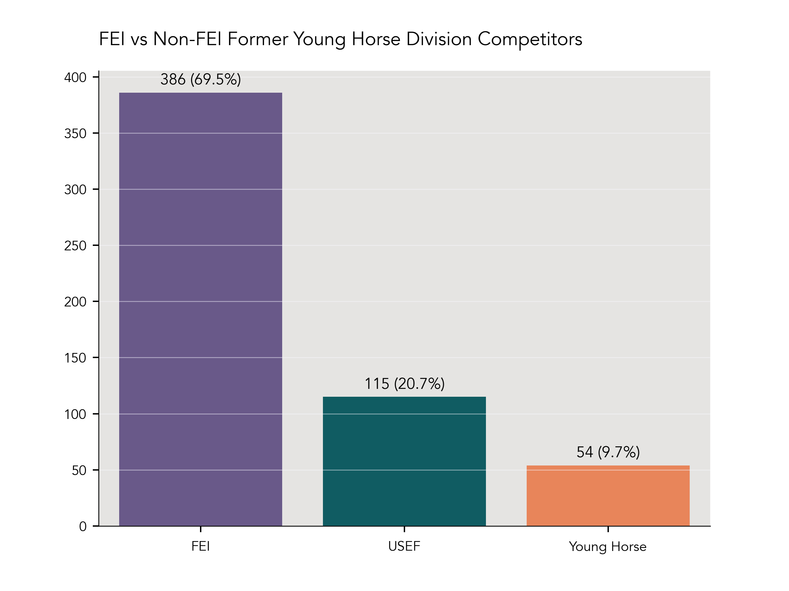

Figure 3 below shows the level breakdown of horses that made it to FEI (*n*=386). 38.1% (147/386) of them competed to Grand Prix. 25.6% (99/386) competed to Prix St. Georges, 24.2% (91/386) I-1, 12% (45/386) I-2, 0.3% (1/386) I-A, 0.3% (1/386) I-B. 

***Figure 3***  
*Breakdown by Level of Former Young Horse Division Competitors That Competed at FEI*
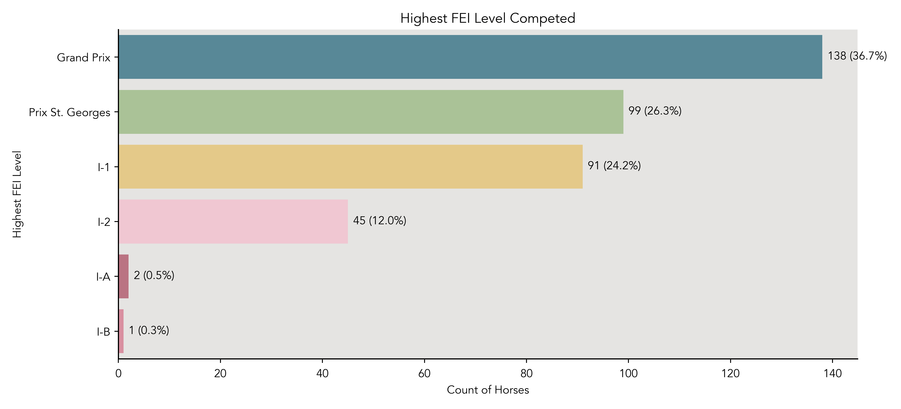

#### CDI Level Competitive Outcomes for Young Horse Division Competitors
Of the horses that made it to FEI (*n*=386), how many competed at the CDI level (Figure 4)? A CDI (Concours de Dressage International) is an international competition sanctioned by the governing body for equestrian sports, the FEI (Fédération Equestre Internationale). I only considered competing at a CDI in the senior divisions (Prix St. Georges, I-1, I-2, Grand Prix) to count as competing at the CDI level. 

The majority of horses, 54.1% (209/386), never competed in a CDI. Most horses, even if they make it to FEI, would not necessarily be competitive on the CDI level. CDI competitions are also much more expensive and complicated to enter and compete in (higher entry fees, horses must have an FEI passport). Finally, there are simply not that many CDI competitions in the USA, and the ones there are tend to be concentrated in certain areas, requiring long travel times for people in many parts of the country. 

45.9% (177/386) participated in at least one CDI at any senior level other than a Young Horse division.

***Figure 4***  
*CDI vs Non-CDI Former Young Horse Division Competitors*
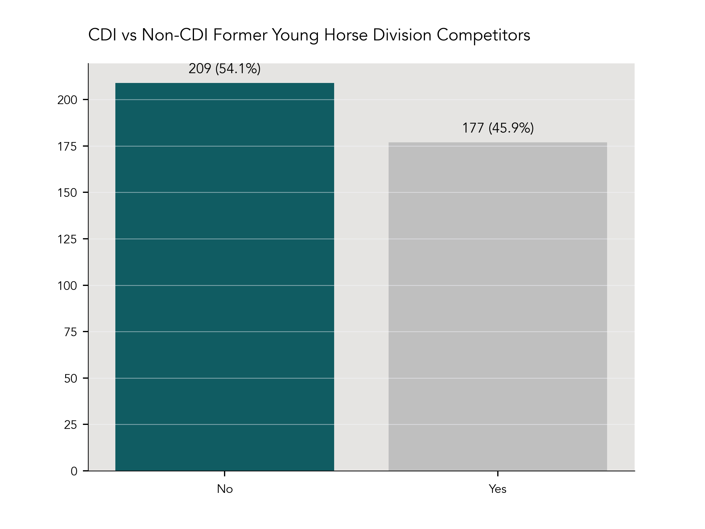

#### Top Ten vs Lower Placing Young Horse Division Competitors
Are horses placing in the top ten versus lower placing horses (11 and under) more likely to make it to FEI (Figure 5)? To answer this question, I looked at the overall placings of the horses that made it to the FEI levels (*n*=386). Because some horses competed at the championships multiple years and placed in the top ten one year but not another, I considered a horse to be in the top ten group if it made top ten at least once. 

The data shows a strong correlation between placing and FEI achievement: 76.7% (296/386) of horses that made it to the FEI levels placed in the top ten of their division at the championships, versus 23.3% (90/386) in the 11 and under placing group. A chi-square test of independence was performed to examine the relationship. The results showed a significant relationship between a top ten placing, and competing at the FEI levels (X2 (1, *n* = 555) = 12.6, *p* < .001).

There could be several explanations for this. For one, horses placing in the top ten could simply be better quality horses. They may also be ridden by more experienced riders that are better able to train them up the levels. 

***Figure 5***  
*Former Young Horse Division Competitors at FEI Placing in Top Ten vs 11 and Under*
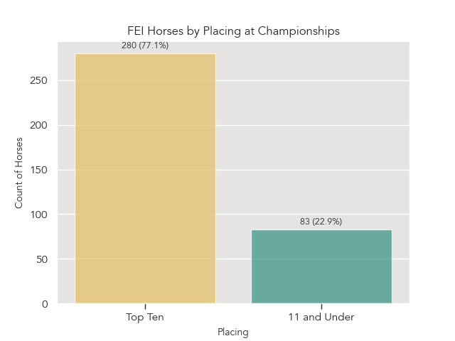

When we look at horses that competed to Grand Prix (*n*=147), the correlation between a top ten placing and level achievment is even more impressive (Figure 6). 90.5% (133/147) of the horses that made it to Grand Prix placed in the top ten of their division, versus a mere 9.5% (14/147) in the 11 and under placing group. Again, a chi-square test of independence was performed to examine the relationship. The results showed a significant relationship between a top ten placing, and competing at the Grand Prix level (X2 (1, *n* = 555) = 32.4, *p* < .001).

***Figure 6***  
*Former Young Horse Division Competitors at Grand Prix by Placing at Championships*
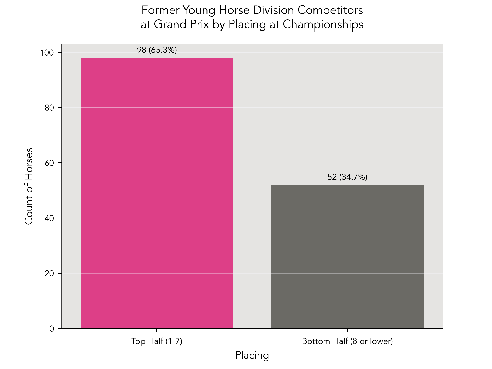

#### Top Three Placing Competitive Outcomes for Young Horse Division Competitors
Does a top three placing correlate with competitive success (Figure 7)? A common argument of people against the young horse development track is that horses successful in these divisions never make it to FEI, or that they "disappear and are never seen again". Of the horses that placed in the top three (*n*=128), 35.2% (45/128) made it to Grand Prix, 17.2% (22/128) Prix St. Georges, 14.8% (19/128) I-2, 14.1% (18/128) I-1, 4.7% (6/128) Fourth Level, 3.1% (4/128) FEI 5 Year Old, 2.3% (3/128) Third Level, 2.3% (3/128) FEI 6 Year Old, 2.3% (3/128) USEF 4 Year Old, 1.6% (2/128) First Level, 0.8% (1/128) I-B, 0.8% (1/128) FEI 7 Year Old, 0.8% (1/128) Second Level. These numbers add up to 82.3% (105/128) of top three competitors making it to the FEI levels. 

***Figure 7***  
*Former Young Horse Division Competitors Placing in the Top Three by Highest Level Competed*
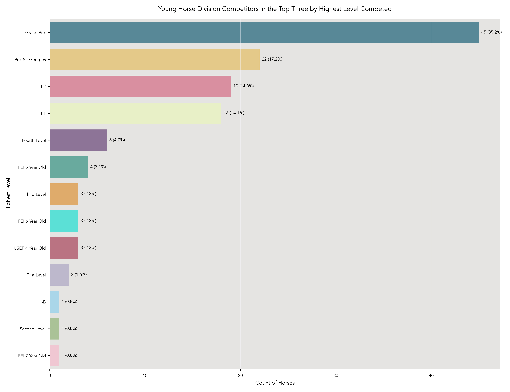

#### Overall Score and FEI Achievement for Young Horse Division Competitors
Does a higher overall score correlate with a horse making it to FEI? To answer this question, I separated FEI horses (*n*=386) into two categories, those that had an overall score of 7.45 (the mean score across the dataset) or above, and those that scored below that threshold. As with the analysis on placings, if a horse competed at the championships more than once, I considered them to be in the 7.45 and above group as long as one of their scores met that criteria. 

59.1% of horses (228/386) that made it to FEI achieved an overall score of 7.45 or higher, compared to 40.9% (158/386) that scored below 7.45 (Figure 8). While a chi-square test of independence showed that there was no significant association between an overall score over 7.45 and a horse going on to compete at the FEI levels (X2 (1, *n* = 555) = 3.8, *p* = .05), the *P* value approached acceptance levels of statistical significance (*P* value below .05). 

***Figure 8***  
*Former Young Horse Division Competitors at FEI Scoring 7.45 or Above vs Below 7.45*
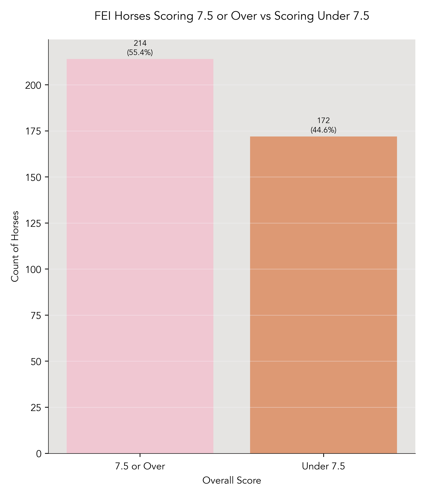

#### Overall Score and Grand Prix Achievement for Young Horse Division Competitors
Does a higher overall score correlate with a horse making it to Grand Prix? To answer this, I used the same overall score threshold as I did when analyzing overall score and FEI achievement (7.45, the mean overall score across the dataset) and applied it to the group of horses that made it to Grand Prix (*n*=147).

67.3% of horses (99/147) that made it to Grand Prix achieved an overall score of 7.45 or higher, compared to 32.7% (48/147) that scored below 7.45 (Figure 9). A chi-square test of independence showed that there was a significant association between an overall score over 7.45 and a horse going on to compete at Grand Prix (X2 (1, *n* = 555) = 9.4, *p* = .002).

***Figure 9***  
*Former Young Horse Division Competitors at Grand Prix Scoring 7.45 or Above vs Below 7.45*
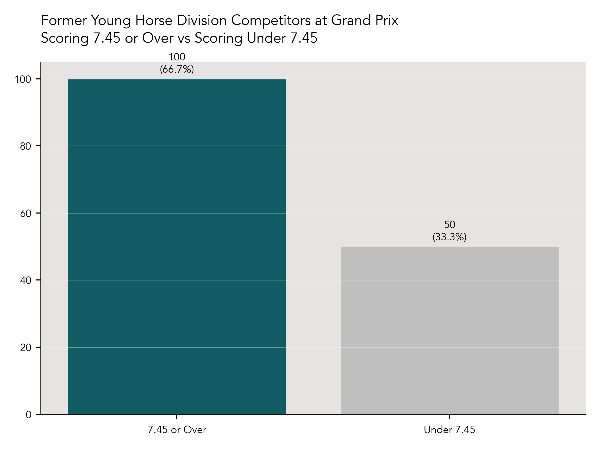

#### Young Horse Division Competitors International Team Horses
As one aim of these championships is to help identify horses that may be potential international team horses, I wanted to see how many horses from this time period (*n*=555) went on to represent the USA (or any other country) on a team in a major championship. I defined this as being named a member of a Pan American Games, World Equestrian Games, or Olympic Games team. 

Four horses from this time period, 0.7% (4/555) of the sample, went on to make international teams (Table 1). These horses were Grandioso (Pan American Games, for the United States), Lucky Strike (named to Pan American Games team for the United States, but did not compete due to injury during transport), Selten HW (Olympic Games, for Denmark), and Sanceo (Pan American and Olympic Games, for the United States). 

***Table 1***  
*Former Young Horse Championship Competitors Selected For an International Team*

| Horse        | Sire        | Damsire         | Country Bred  |  Breeder                   | Studbook   | Team Made                      |
|:-------------|:------------|:----------------|:--------------|:---------------------------|:-----------|:-------------------------------|
| Grandioso    | Grosso Z    | Palisandergrund | Germany       | Willi Hillebrecht          | Westfalen  | Pan American Games             |
| Selten HW    | Sandro Hit  | Hohenstein      | USA           | Irene Hoeflich-Wiederhold  | Hanoverian | Olympic Games                  |
| Sanceo       | San Remo    | Ramiro's Son II | Germany       | Gerhard Dustmann           | Hanoverian | Olympic and Pan American Games |
| Lucky Strike | Lord Laurie | His Highness    | Germany       | Monika Hartwitch           | Hanoverian | Pan American Games             |

### 2008 - 2023, Developing Horse Division Competitive Outcomes

#### Highest Level of Competition Achieved by Developing Horse Division Competitors
Figure 10 below shows the breakdown of the highest level achieved in competition by the horses that competed in the Developing Prix St. Georges and Developing Grand Prix divisions from 2002-2023 (*n*=283). 65% (184/283) competed to Grand Prix, 16.3% (46/283) I-1, 14.8% (42/283) I-2, 3.5% (10/283) Prix St. Georges, and 0.4% (1/283) I-A. 

***Figure 10***  
*Highest Level of Competition Achieved by Former Developing Horse Program Competitors*
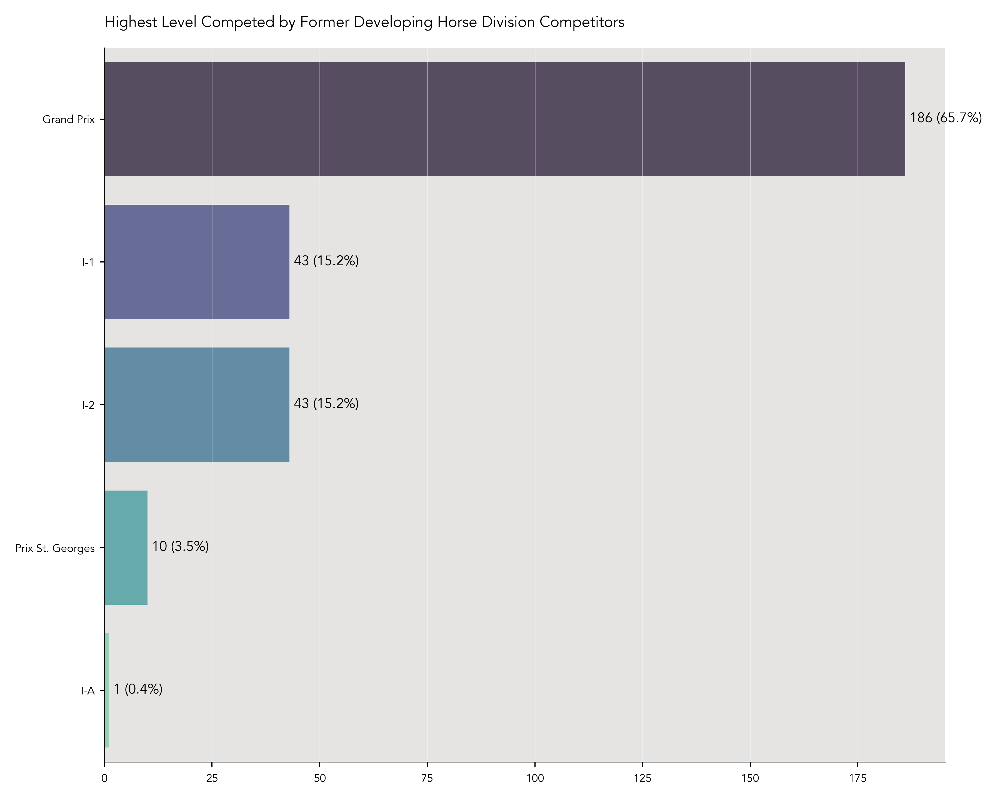

#### CDI Level Competitive Outcomes for Developing Horse Division Competitors
Of the horses that ceompeted in the Developing Prix St. Georges and Grand Prix divisions (*n*=283), how many competed at the CDI level (Figure 10)? As when looking at the Young Horse division competitors, I only considered competing at a CDI in the senior divisions (Prix St. Georges, I-1, I-2, Grand Prix) to count as competing at the CDI level. 

The majority of Developing Horse division participants, 67.5% (191/283), participated in at least one CDI. This is significantly higher than the number of former Young Horse competitors who competed at the CDI level (45.9%). Why? One explanation is that Developing Horse division competitors are already at the FEI level—it is a smaller hill to climb to go from competing in the Developing PSG or GP divisions to competing in a CDI than it is for a 4, 5, or 6 year old to get there. Or, it may be the case that the riders aiming to compete in the Developing Horse divisions tend to be more focused on CDI competition as a goal. 

***Figure 10***  
*CDI vs Non-CDI Former Developing Horse Division Competitors*
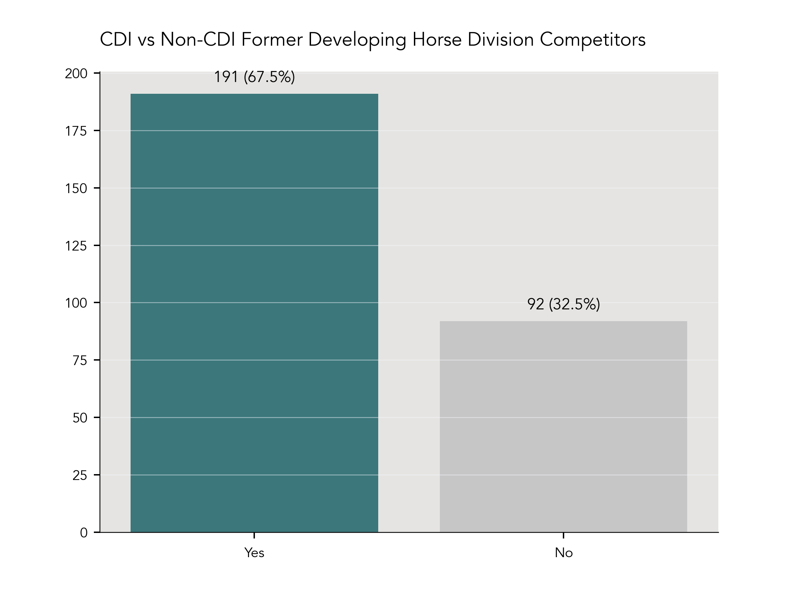

#### Overall Score and Grand Prix Achievement for Developing Horse Division Competitors
Does a higher overall score correlate with a horse making it to Grand Prix? To answer this, I used the mean overall score (65.9% for the Developing divisions) as the threshold, separating horses that competed to Grand Prix (*n*=184) as scoring equal to or above 65.9%, or below.

59.2% of horses (109/184) that made it to Grand Prix achieved an overall score of 65.9% or higher, compared to 40.8% (75/184) that scored below 65.9% (Figure 11). A chi-square test of independence showed that there was no significant association between an overall score over 65.9% and a horse going on to compete at Grand Prix (X2 (1, *n* = 283) = 1.2, *p* = .27).

***Figure 11***  
*Former Developing Horse Competitors at Grand Prix Scoring 65.9% or Above vs Below 65.9%*
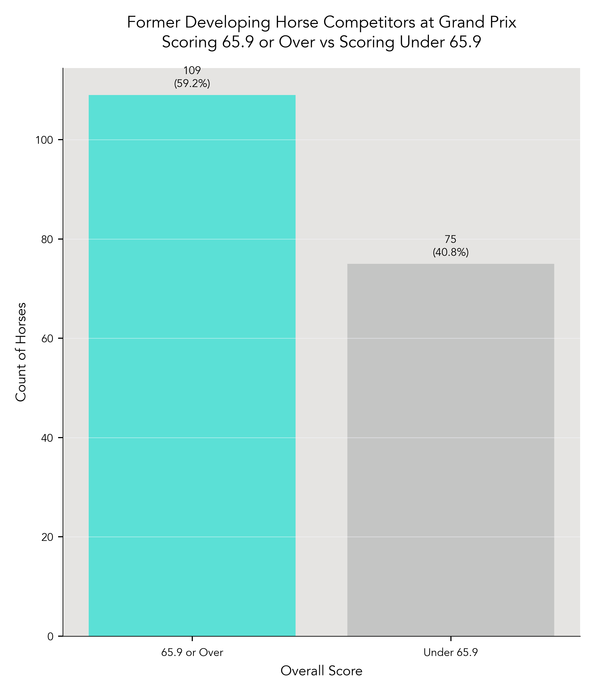

#### Developing Horse Division Competitors International Team Horses
As stated previously, one aim of these championships is to help identify horses that may be potential international team (Olympics, Paralympics, World Equestrian Games, Pan American Games) horses. Of the competitors in the Developing Horse division during this time period (*n*=283), 2.5% (7/283) were named to international teams, all for the United States (Table 2). These horses were Grandioso (Pan American Games), Rosevelt (Olympic Games), Sanceo (Olympic Games and Pan American Games), Lucky Strike (Pan American Games, did not compete due to injury in transport), Faro SQF (Pan American Games), Fire Fly (Pan American Games), and Jane (Olympic Games). Three of the seven horses also competed in the Young Horse division in previous years (Grandioso, Sanceo, Lucky Strike). 

***Table 2***  
*Former Developing Horse Championship Competitors Selected For an International Team*

| Horse        | Sire        | Damsire             | Country Bred   | Breeder           | Studbook   | Team Made                            |
|:-------------|:------------|:--------------------|:---------------|:------------------|:-----------|:-------------------------------------|
| Grandioso    | Grosso Z    | Palisandergrund     | Germany        | Willi Hillebrecht | Westfalen  | Pan American Games                   |
| Rosevelt     | Rotspon     | Lauries Crusador xx | Germany        | Henry Peters      | Hanoverian | Olympic Games                        |
| Sanceo       | San Remo    | Ramiro's Son II     | Germany        | Gerhard Dustmann  | Hanoverian | Olympic Games and Pan American Games |
| Lucky Strike | Lord Laurie | His Highness        | Germany        | Monika Hartwitch  | Hanoverian | Pan American Games                   |
| Faro SQF     | Fidertanz   | Rotspon             | USA            | Star Quarry Farm  | Hanoverian | Pan American Games                   |
| Fire Fly     | Briar Junior | OO Seven           | Netherlands    | Anton Geessink    | KWPN       | Pan American Games                   |
| Jane         | Desperado   | Metall              | Netherlands    | H.J. Van Oort     | KWPN       | Olympic Games                        |

#### Young and Developing Horse Division Competitors
Of the horses that competed in the Developing Horse divisions (*n*=283), how many competed in at least one Young Horse division previously (Figure 12)? 62.2% (176/283) competed in only the Developing Horse division, compared to 37.8% (107/283) that competed in at least  one Young Horse division and one Developing Horse division.

***Figure 12***  
*Horses That Competed In At Least One Young Horse and One Developing Horse Division*
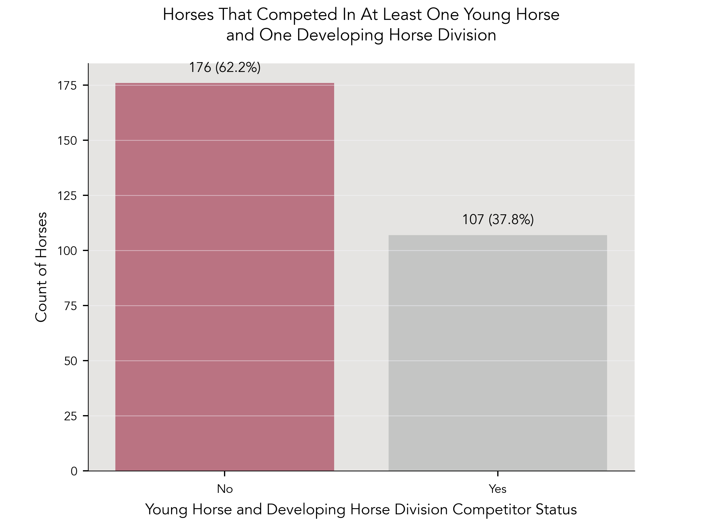

### 2002 - 2024, All Divisions (4/5/6 Year Old, Developing Prix St. Georges, Developing Grand Prix) Breeding and Bloodlines Analysis

### Analysis of Scores by Sire 
Because the scoring format for the 4/5/6 Year Old divisions is different than the scoring format for the Developing Horse divisions, I broke out the analysis of scores by sire out into two different groups. In order to have a better sample sizes, I included only stallions with 10 or more scores for the Young Horse divisions, and 6 or more for the Developing Horse divisions.

#### Summary Statistics for Scores by Sire, Young Horse Divisions 
The sire with the highest mean score in the Young Horse divisions (Table 3) is Grand Galaxy Win (8.218). The rest were Sir Donnerhall I (7.803), Furstenball (7.799), Jazz (7.764), Secret (7.758), San Amour (7.707), Sandro Hit (7.687), Contucci (7.628), Hotline (7.623), Rotspon (7.521), and Florestan I (7.369). 

***Table 3***  
*Summary Table of Young Horse Divisions Scores by Sire*

| Sire             |   Number of Scores |   Mean Score |   Median Score |   Standard Deviation |   Variance |
|:-----------------|-------------------:|-------------:|---------------:|---------------------:|-----------:|
| Contucci         |                 10 |      7.628   |          7.452 |             0.81952  |   0.671612 |
| Florestan I      |                 11 |      7.369   |          7.4   |             0.385015 |   0.148237 |
| Furstenball      |                 22 |      7.79964 |          7.67  |             0.565568 |   0.319867 |
| Grand Galaxy Win |                 12 |      8.21858 |          8.119 |             0.579999 |   0.336399 |
| Hotline          |                 13 |      7.62323 |          7.58  |             0.502625 |   0.252632 |
| Jazz             |                 14 |      7.764   |          7.758 |             0.722566 |   0.522102 |
| Rotspon          |                 10 |      7.5211  |          7.486 |             0.708312 |   0.501706 |
| San Amour        |                 10 |      7.7072  |          7.61  |             0.509099 |   0.259182 |
| Sandro Hit       |                 31 |      7.68797 |          7.636 |             0.525052 |   0.27568  |
| Secret           |                 10 |      7.758   |          7.608 |             0.319512 |   0.102088 |
| Sir Donnerhall I |                 24 |      7.80379 |          7.718 |             0.382872 |   0.146591 |

#### Summary Statistics for Scores by Sire, Developing Horse Divisions
The sire with the highest mean score in the Developing Horse divisions (Table 4) is Jazz (68.452%). The rest of the group were Sir Donnerhall I (67.895%), Florencio I (67.528%), Diamond Hit (67.462%), Fidertanz (67.273%), Florestan I (67.129%), Quaterback (65.764%), and Sandro Hit (64.629%). 

***Table 4***  
*Summary Table of Developing Horse Divisions Scores by Sire*

| Sire             |   Number of Scores |   Mean Score |   Median Score |   Standard Deviation |   Variance |
|:-----------------|-------------------:|-------------:|---------------:|---------------------:|-----------:|
| Diamond Hit      |                  7 |      67.4623 |        67.774  |              1.72814 |    2.98647 |
| Fidertanz        |                 13 |      67.2732 |        67.807  |              3.24802 |   10.5496  |
| Florencio I      |                  7 |      67.5287 |        67.306  |              1.43564 |    2.06105 |
| Florestan I      |                  6 |      67.1293 |        66.8035 |              1.75294 |    3.07282 |
| Jazz             |                  7 |      68.4527 |        68.705  |              2.76839 |    7.66396 |
| Quaterback       |                  6 |      65.7647 |        65.201  |              2.79883 |    7.83345 |
| Sandro Hit       |                  9 |      64.6292 |        64.273  |              2.26267 |    5.11968 |
| Sir Donnerhall I |                 10 |      67.8955 |        68.7305 |              3.90009 |   15.2107  |

#### Distribution of Scores by Sire, Young Horse Division

***Figure 13***  
*Histogram of Young Horse Divisions Scores by Sire*

#### Distribution of Scores by Sire, Developing Horse Division

***Figure 14***  
*Histogram of Developing Horse Divisions Scores by Sire*
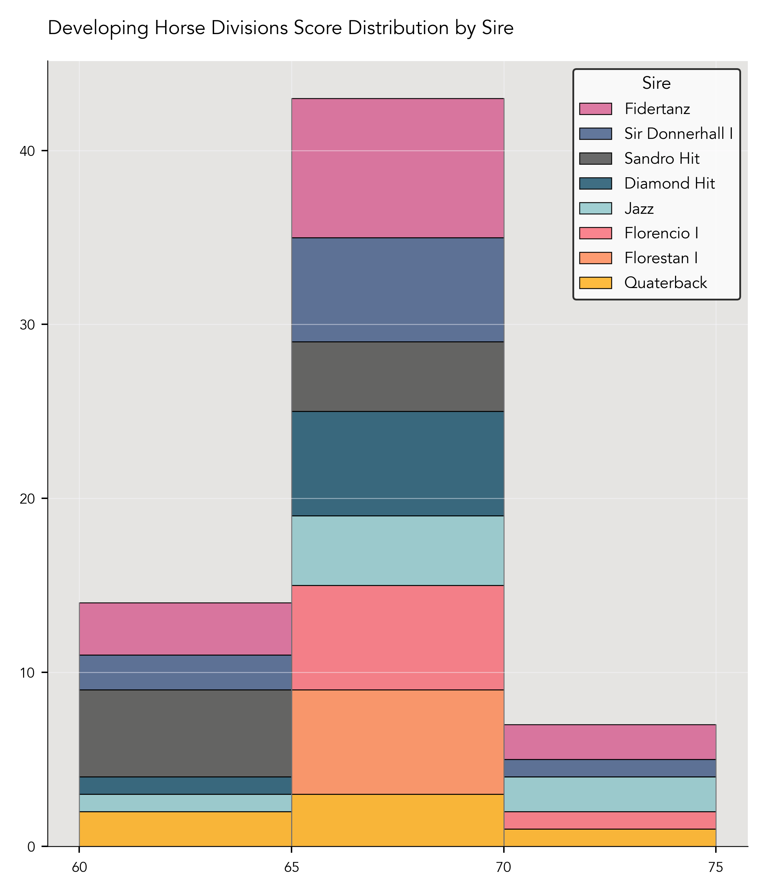

#### US-Bred vs All Other Countries
Far more horses participating in the championships are foreign-bred than bred in the USA (Figure 15). Of all horses competing at championships from 2002-2024 (*N*=888), 36.9%  of horses were bred in the USA (328/888). 35% (311/888) were bred in Germany, 19.5% (173/888) were bred in the Netherlands, 3.3% (29/888) were bred in Denmark, 0.9% (8/888) were bred in Belgium, 0.8% (7/888) were bred in Canada, 0.6% (5/888) were bred in Norway, 0.6% (5/888) were bred in Spain, 0.6% (5/888) were bred in Great Britain, and .02% (2/888) were bred in Sweden. Why are there so many more foreign-bred horses than US-bred horses? There are many possible explanations:

* Many people shop for horses in Europe because it is easier to see many horses in one location versus the USA, where one can spend a lot of money traveling across the country to look at only one or two horses

* Depending on the exchange rate, it may be advantageous cost-wise to buy from other countries, as breeders in the USA face much higher costs to produce and raise foals

* The cost to raise a young horse to riding age is cheaper in Europe, so buying a foal overseas and leaving it there to grow up could also be adventageous to a buyer 

* European countries produce far more warmblood foals than the USA, so more to choose from, as well as bloodlines that might not be as available in the USA

* Bias against American breeders—some may think American-bred foals aren't as good as those produced in Europe

* Hard to get top American-bred foals into the hands of riders that can develop them to Grand Prix

* USA lacks a well-developed pipeline from foal to young horse to FEI

* More young horse specialists in Europe makes it easier for buyers who may not have access to a good young horse specialist in their part of the USA

***Figure 15***  
*Championship Competitors by Country Bred*

#### Top Ten Sires Represented by Number of Horses
Figure 16 below shows the top ten sires of championship competitors by number of offspring. The stallion with the most offspring competing was Sandro Hit (24). The rest of the top ten were Furstenball (19), Sir Donnerhall I (18), Jazz (13), Rotspon (12), Fidertanz (12), Florestan I (12), Hotline (10), Grand Galaxy Win (10), Florencio I (9), Belissimo M (9), Secret (9), and Sir Sinclair (9). The four-way tie for tenth place in the top ten means there are actually 13 sires represented in this chart.

***Figure 16***  
*Top Ten Sires by Number of Horses*
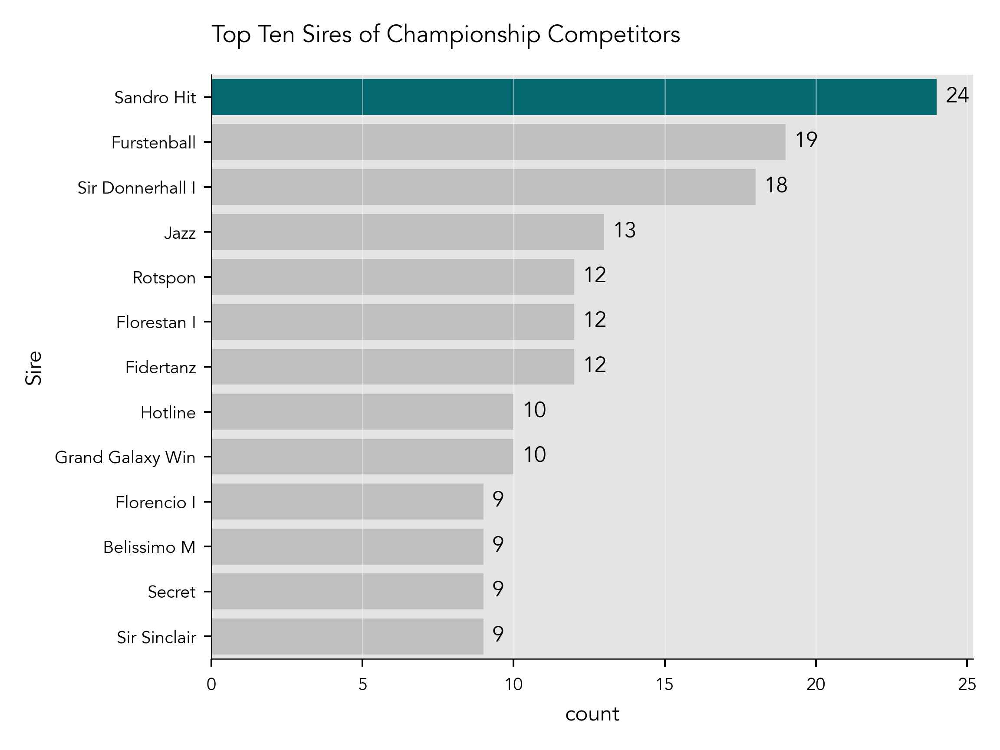

#### Top Ten Damsires Represented by Number of Horses
Figure 17 below shows the top ten damsires of championship competitors by number of horses. The damsire with the most horses competing was Rubinstein (25). The rest of the top ten were De Niro (20), Sandro Hit (20), Jazz (16), Rotspon (16), Weltmeyer (14), Ferro (14), Sir Donnerhall I (13), Krack C (11), and Rohdiamant (11). 

This column had the second most null values of all the columns (18/888 missing values, 2% of the total).

***Figure 17***  
*Top Ten Damsires by Number of Horses*

#### Top Ten Sires of Grand Prix Horses 
Figure 18 below shows the top ten sires of Grand Prix horses by number of horses. The top sire of Grand Prix horses was also Sandro Hit (11). The rest of the top ten were Sir Donnerhall I (9), Jazz (8), Fidertanz (6), Belissimo M (5), Florestan I (5), Florencio I (5), Rotspon (4), Hotline (4), and Quaterback (4). 

***Figure 18***  
*Top Ten Grand Prix Sires by Number of Horses*

#### Highest Percentage of Grand Prix Horses by Sire
When looking at the highest percentage of Grand Prix horses, I only looked at sires with 9 or more offspring total, in order to have a better sample size (although this is obviously still quite small). When we look at sires of Grand Prix horses by the highest percentage versus solely looking at the count, it shakes things up a bit (Figure 19).

While ranked third in terms of number of Grand Prix offspring, the top producer of Grand Prix horses by percentage was Jazz at 61.5% (8/13). Florencio I and Belissimo M were both at 55.6% (5/9), Sir Donnerhall I (9/18) Fidertanz (6/12) were both at 50%. While Sandro Hit had the highest number of Grand Prix offspring, this was only 45.8% of the total number of offspring (11/24). The rest were Florestan I at 41.7% (5/12), Hotline at 40% (4/10), Rotspon at 33.3% (4/12), Sir Sinclair at 33.3% (3/9), and Furstenball at 15.8% (3/19) It is interesting to note that while Furstenball was ranked second overall in terms of number of offspring competing, he was last by percentage of Grand Prix horses. 

***Figure 19***  
*Percentage of Grand Prix Offspring by Sire*
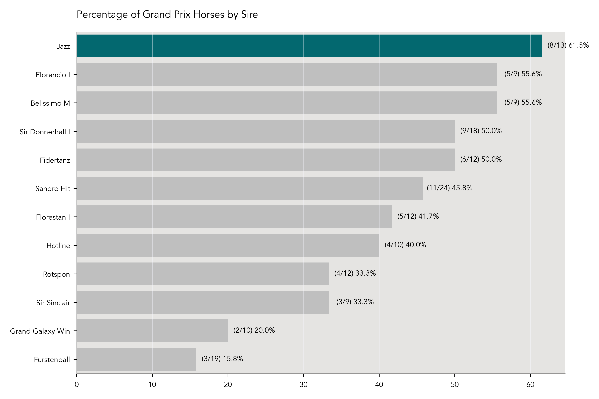

#### Top Ten Damsires of Grand Prix Horses 
The top damsire of Grand Prix horses by number of horses (Figure 20) was De Niro (8). The rest of the top ten were Rubinstein (6), Rotspon (5), Ferro (5), Weltmeyer (5), Brentano II (5), Jazz (4), Rohdiamant (4), Wolkenstein II (4), and Sandro Hit (4). 

Once again, the prevalence of null values (2%) in the damsire column affects the completeness of this data. 

***Figure 20***  
*Top Ten Grand Prix Damsires by Number of Horses*

#### Highest Percentage of Grand Prix Horses by Damsire
When looking at the highest percentage of Grand Prix horses (Figure 21), I only looked at damsires with 10 or more horses total, in order to have a better sample size. Just as with the percentage of Grand Prix horses by sire, there is a shakeup in the rankings.

De Niro had both the highest count of Grand Prix horses, and the highest percentage at 40% (8/20). While ranked 8th in terms of number of Grand Prix horses,Rohdiamant came in second in percentage with 36.4% (4/11). Weltmeyer and Ferro both came in at 35.7% (5/14), then Rotspon with 31.2% (5/16). Romanov and Donnerhall were both at 30% (3/10), and Jazz at 25% (4/16). Interestingly, while Rubinstein was the second highest in terms of number of Grand Prix horses, he was second to last in terms of percentage at 24% (6/25). Sandro Hit was last in terms of number of Grand Prix horses and percentage, with 20% (4/20). 

***Figure 21***  
*Percentage of Grand Prix Horses by Damsire*

#### Top Ten Most Prominent Breeders by Horse Count
The most prominent breeder over all years and divions (Figure 22) is DG Bar Ranch (USA), with 17 horses. The rest of the top ten were Maryanna Haymon (USA, 13 horses), Nancy Holowesko (USA, 11 horses), Leatherdale Farms (USA, 7 horses), Jennifer Vanover (USA, 7 horses), Oak Hill Ranch (USA, 6 horses), Judy Yancey (USA, 6 horses), Horses Unlimited (USA, 6 horses), Gestut Lewitz (Germany, 6 horses), Maurine Swanson (USA, 6 horses), and Hilltop Farm (USA, 6 horses). 

This column had the most null values overall—47 missing values, which equates to 5.3% of the total (*N*=888). This data was also frequently extremely difficult to track down. While making submission of registration papers a condition for a USEF/USDF number may not be practical for a variety of reasons, it would help American sporthorse breeding to make this data easily available. Breeders also clearly deserve recognition for the essential role they play in our sport. 

***Figure 22***  
*Top Ten Most Prominent Breeders by Number of Horses*
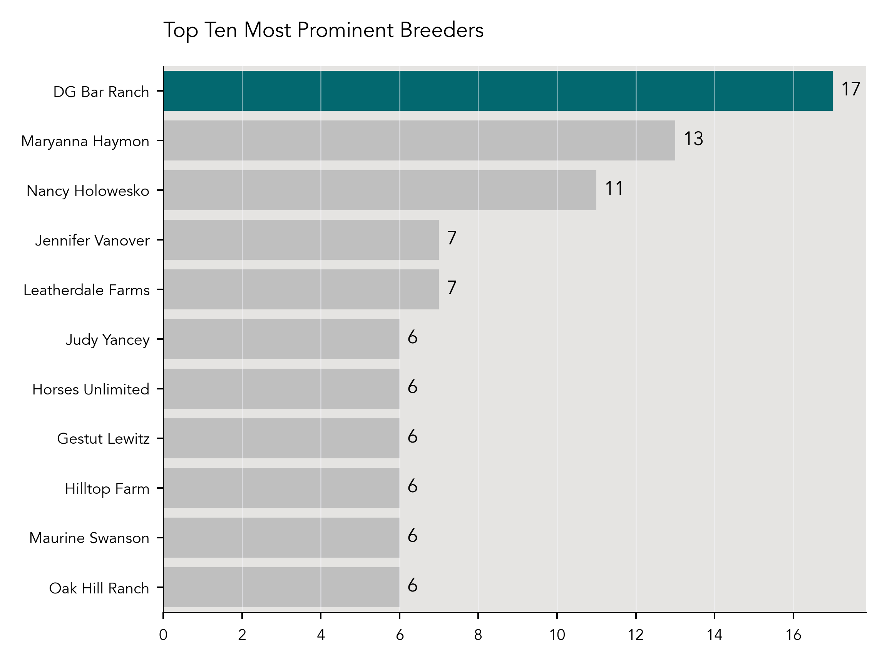

#### Top Ten Studbooks by Number of Horses
In order to compete at these championships, all horses must be registered with a studbook recognized by the World Breeding Federation for Sport Horses (WBFSH), or a national breed registry such as Jockey Club (the national registry for Thoroughbreds). Warmbloods are not really a breed (the Trakhener being an exception), they are a type. While there is definitly a lot of crossover in bloodlines through all the warmblood studbooks, each has their own directives and requirements for approval of mares and stallions, and the registration of offspring. I was curious to see what the most represented studbooks were, so I calculated the number of horses attributed to each (Figure 23) from the database of championship competitors over all years of the program (*N*=888). The studbook with the most horses competing over all years was KWPN (Koninklijk Warmbloed Paardenstamboek Nederland, also known as Dutch Warmblood), with 29.1% (258/888). The Hanoverian studbook was a close second, with 28.2% (250/888). 

Oldenburg was third, with 22.4% (199/888). There was sometimes considerable difficulty in differentiating horses that were truly in the official German Oldenburg studbook (Oldenburg Horse Breeders Society/GOV, which is also just referred to as Oldenburg by some), and horses registered with Oldenburg NA (an American studbook no longer affiliated with the German studbook but was at one point the official American branch, also often just referred to as Oldenburg). Because of this, all horses that were listed as bring registered Oldenburg are combined. 

The rest of the top ten were Westfalen 5.6% (50/888), Danish Warmblood 4.3% (38/888) , Rhinelander 2% (18/888), American Warmblood 1.1% (10/888), Pura Raza Espanola (PRE) 0.9% (8/888), Holsteiner 0.8% (7/888), and Swedish Warmblood 0.7% (6/888). 

It makes sense that KWPN, Hanoverian, and Oldenburg are the most dominant studbooks, as they have by far the biggest presence in the United States. The American branch of the KWPN, KWPN-NA, [states on their website](https://kwpn-na.org/the-kwpn-na/about/about-kwpn-na/) they have registered an average of more than 550 foals a year over the last decade. 

***Figure 23***  
*Top Ten Most Prominent Studbooks by Number of Horses*
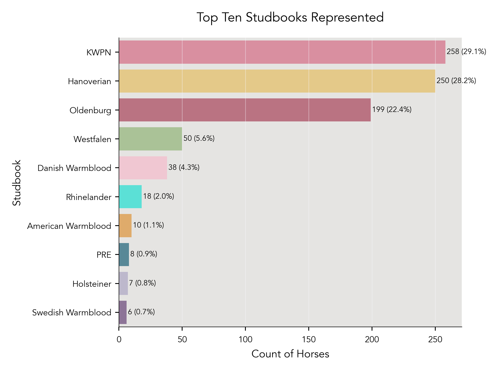

#### Most Championship Appearances
The horse with the most appearances at the Markel/USEF Young and Developing Horse Championships to date (Figure 24) is WakeUp, ridden by Emily Miles. WakeUp competed in the Four and Six Year Old divisions as a young horse, and represented the USA at the World Young Horse Championships in Verden, Germany as a 5 year old in 2010. 

He also competed two years in a row in both the Developing Prix St. Georges and Developing Grand Prix divisions, and went on to compete at the CDI level at Grand Prix. 

There were several horses that have five appearances at championships. Pikko del Cerro HU was the only one who competed in every division excluding the FEI 7 Year Old, which was only introduced in 2022 (USEF 4 Year Old, FEI 5 Year Old, FEI 6 Year Old, Developing Prix St. Georges, Developing Grand Prix). The rest consisted of Fashion Designer OLD (FEI 5 Year Old, FEI Six Year Old, two years in Developing Prix St. Georges, Developing Grand Prix), Quantum Jazz (USEF 4 Year Old, FEI 6 Year  Old, three years Developing Grand Prix), Floretienne (USEF 4 Year Old, FEI 6 Year Old, Developing Prix St. Georges, two years Developing Grand Prix), Sternlicht Hilltop (USEF 4 Year Old, FEI 6 Year Old, three years Developing Prix St. Georges), Don Cesar (FEI 5 Year Old, FEI 6 Year Old, two years Developing Prix St. Georges, Developing Grand Prix), Flavius MF (FEI 5 Year Old, FEI 6 Year Old, two years Developing Prix St. Georges, Developing Grand Prix), Au Revoir (FEI 5 Year Old, FEI 6 Year Old, two years Developing Prix St. Georges, Developing Grand Prix), Ronin (USEF 4 Year Old, FEI 5 Year Old, two years Developing Prix St. Georges, Developing Grand Prix), Sole Mio (USEF 4 Year Old, FEI 5 Year Old, Developing Prix St. Georges, two years Developing Grand Prix), and Spirit of Joy (FEI 5 Year Old, FEI 6 Year Old, Developing Prix St. Georges, two years Developing Grand Prix). 

***Figure 24***  
*Horses with Most Appearances at Championships*
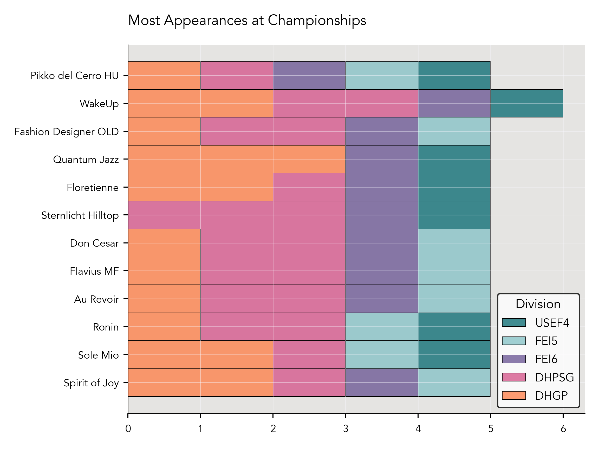

## Final Thoughts
The data analyzed clearly shows that the majority of Young Horse Championship participants have been quite successful. The majority made it to FEI (69.5%), and of those that made it to FEI, a fair number made it to Grand Prix (38.1%). A mere 9.7% of horses that competed in the Young Horse divisions during the analyzed time frame never competed beyond the Young Horse divisions.

Similarly, Developing Horse division competitors were also successful. The majority made it to Grand Prix (65%), and the majority were also CDI competitors (67.5%). 

In terms of identifying up coming international team horses, both programs may not have been as successful as would be ideal. Only 0.7% of Young Horse competitors, and 2.5% of Developing Horse competitors went on to be named to a team. Of course, the number of horses being named to a team is going to be small regardless—a team consists of only three or four horses, depending on the competition, and these competitions occur only every four years. However, it would be worth looking into why we don't see more horses from both divisions, but in particular the Developing Horse division, growing into team contenders. 

Of course, it won't be the case that every horse that participates goes far in the sport. Some will have career-ending injuries, some will end up with people who aren't capable of training them up the levels, some will end up with less ambitious riders, some will die young, some will become career broodmares. Sadly, for sure there will be some who end up pushed too hard too soon, never end up achieving their full potential. 

While certainly not the only path to success, the Young Horse and Developing Horse programs are one option. There are horses who can handle the requirements of these tests without undue stress, and those whose development doesn't align with the requirements of the tests. Both types of horses can make it to FEI, and be successful. The tests themselves are not the problem, the real issue is the lack of consideration for where a horse is in their development. 

I hope to expand this analysis in the future to look at career length, as well as differentiating high performing horses at the FEI levels in general and at Grand Prix. If there is an area of inquiry that you think I have overlooked, you can [contact me by email](byrne.sio@gmail.com).

## Acknowledgements
The following sites were utilized to research this project and gather data:

* [United States Dressage Federation (USDF)](www.usdf.org)
* [United States Equestrian Federation (USEF)](www.usef.org)
* [Equestrian Hub](www.equestrian-hub.com)
* [Fox Village](www.foxvillage.com)
* [Horse Telex](www.horsetelex.com)
* [Eurodressage](www.eurodressage.com)
* [DressageDaily](www.dressagedaily.com)