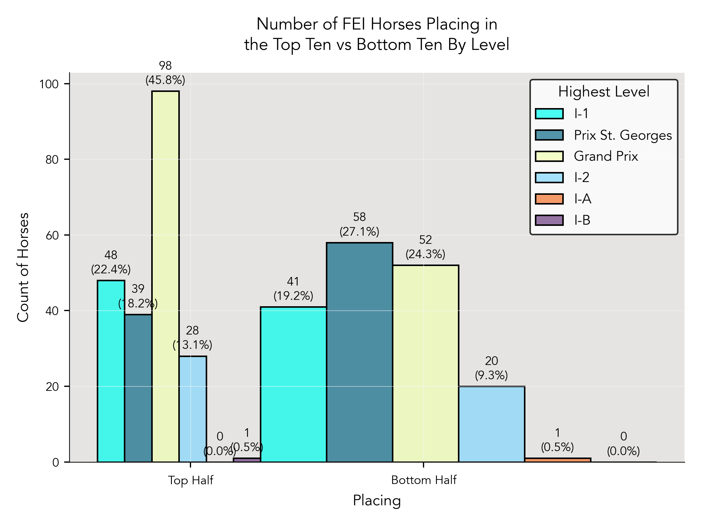
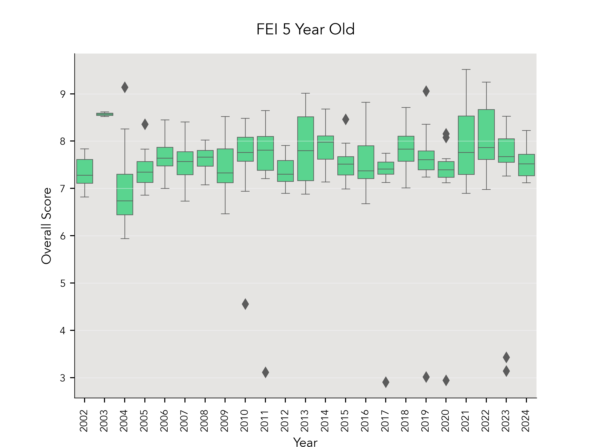
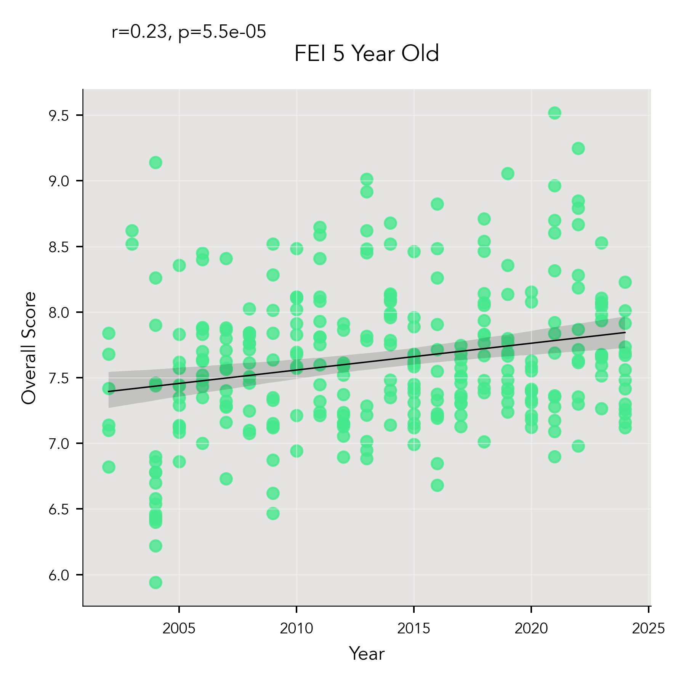
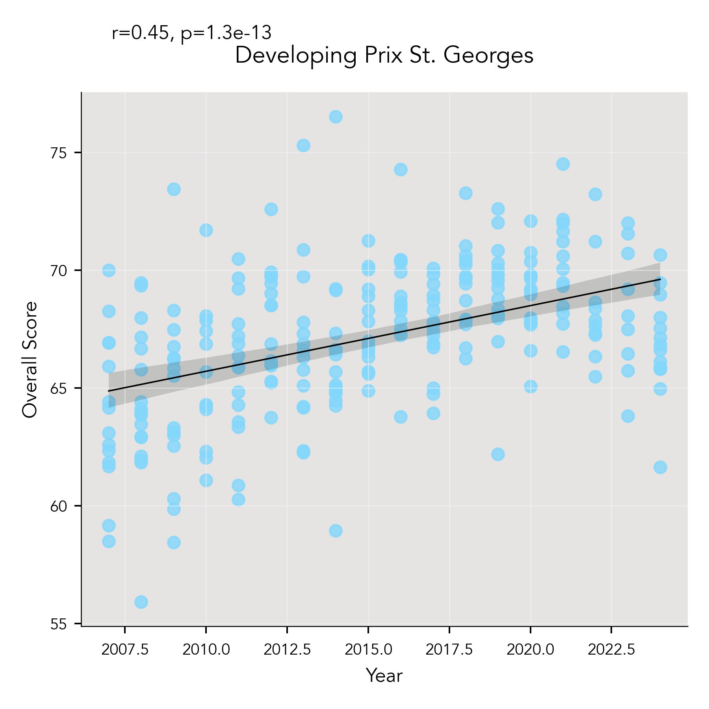
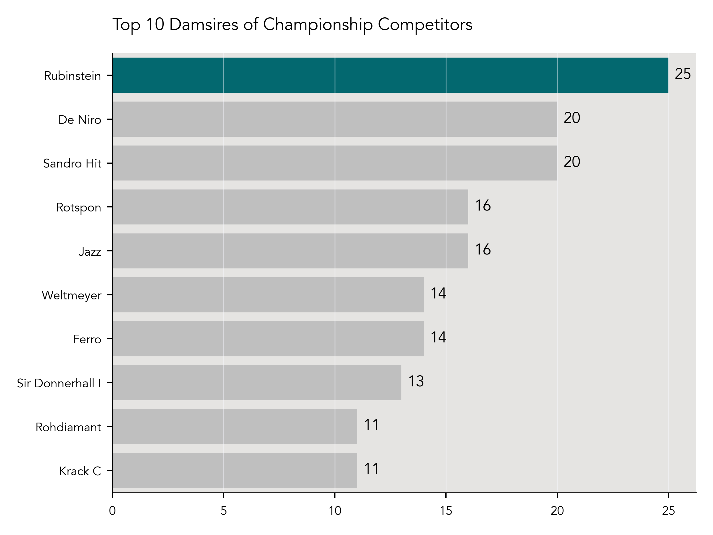
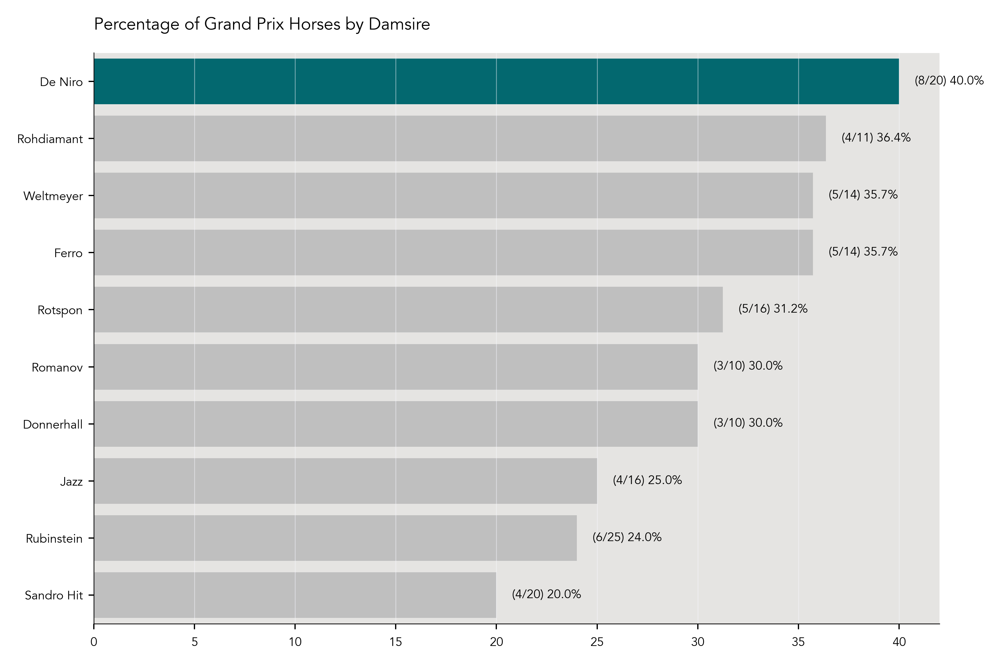

# Markel/USEF Young and Developing Dressage Horse Championship Data Analysis

## Introduction
The aim of this project is to analyze data from the USEF Young and Developing Horse programs over the years. The program can be divisive—some claim that horses that participate in these programs end up washing out, or that many do not make it to the FEI level. Since we now have more than 20 years of data from these championships, I decided to look into these claims.

My aim is to update this project at the end of each competition season. 

Questions, comments, corrections, or suggestions for further areas of exploration are welcome—contact me by email at (young.dressage.horse.project@gmail.com).

## Data Acquisition and Cleaning
The current format of the competition for all divisions (4/5/6/7 Year Old, Developing Prix St. Georges, and Developing Grand Prix) involves two rounds, with round one counting for 40% of the overall score, and round two counting for 60% of the overall score. Overall scores determine the final placings. 

To further complicate matters, early years of this program invited more horses to participate, and held both Final and Consolation Final rounds. To simplify this analysis, I did not include any Consolation Final results. 

For more recent years of the competition (2021-2023), the competition software system Equestrian Hub (www.equestrian-hub.com) has automatically calculated these placings, which made it easy to obtain the data. For prior years, varying levels of detective work were required. I was able to find official overall placing records for some years on the United States Equestrian Federation (USEF) website, but not all were available. For the years that had only the scores from each class available, I wrote a small program in Python to take each individual round of scores, and calculate the overall score using the 40/60 formula (available in the 'resources' folder for this project). While I have endeavored to do this without error, the lack of official overall rankings to compare to means that there may be errors involved as to exact overall placings of some horses. If you come across an error, please contact me at (young.dressage.horse.project@gmail.com) and I will make the correction.

Next, I looked up each horse in the United States Dressage Federation (USDF) database, to determine a) what is the highest level to which this horse competed?,  and b) did this horse ever compete at the CDI (international) level? For a), I did not consider scores received—I was only concerned if that horse had a test on its record at that level. Therefore, this analysis does not differentiate between high and low scoring horses at any level. For b), I only considered horses to be CDI competitors if they had competed at a CDI at a level OTHER THAN FEI Young Horse tests. 

I had the most difficulty acquiring the data on bloodlines and breeders, ironically. Because so many people fail to include this information on entry forms, lots of the data was incomplete. USEF does have a horse search function on their website, but they only list sire and dam (no damsire), and frequently the breeder and country of birth are left out. The USDF database also has frequently incomplete pedigree and breeder data. Finding this information required a lot of detective work in some cases, frequently utilizing Horse Telex (www.horsetelex.com), a pedigree database. I also utilized old Eurodressage (www.eurodressage.com) and DressageDaily (www.dressagedaily.com) articles about various years of the championships. 

## Analysis Overview

For the analysis of competitve careers of participants, I am focusing on the years 2002-2019. Horses that competed in the USEF 4 Year Old division in 2019 would be 8 in 2023, and 8 is the youngest age a horse is allowed to compete at the highest of the FEI levels, Grand Prix. While it is rare to see a horse competing at that level at that age, it is legal, so I went with the lowest legal age to compete at Grand Prix versus the more common lowest age (9-10 years old).

The analysis of bloodlines and other breeding data will look at all years of the program (2002-2023). 

### 2002 - 2019, 4/5/6 Year Old Division Competitive Outcomes

#### Highest Level of Competition Achieved

#### FEI vs Non-FEI Horses
Do horses that compete in the 4, 5, and 6 Year Old divisions make it to the FEI (Fédération Equestre Internationale) levels? 

To answer this question, I looked only at horses that competed in the 4/5/6 Year Old divisions during the years 2002-2019, 520 horses total, and considered them to have competed at FEI if they competed at any FEI level other than the FEI Young Horse divisions. Those levels are comprised of Junior, Prix St. Georges, Intermediate-1 (I-1), Intermediate-A (I-A), Intermediate-B (I-B), Intermediate-2 (I-2), and Grand Prix. 

The overwhelming majority, 363 horses, made it to FEI (69.81%). 112 horses (21.54%) competed at the USEF levels (Training-Fourth). Only 45 horses (8.65%) never competed at any level other than a Young Horse division. 

#### CDI vs Non-CDI Horses
Unsurprisingly, the vast majority of horses, 351 total (67.50%), never competed in a CDI (Concours de Dressage International). Most horses, even if they make it to FEI, would not necessarily be competitive on the CDI level. CDI competitions are also much more expensive and complicated to enter and compete in (higher entry fees, horses must have an FEI passport). Finally, there are simply not that many CDI competitions in the USA, and the ones there are tend to be concentrated in certain areas, requiring long travel times for people in many parts of the country. 

169 horses (32.50%) participated in at least one CDI at any level other than a Young Horse division.

#### Top Ten vs Bottom Ten Placing Horses
Are horses placing in the top ten versus the  bottom ten more likely to make it to FEI? According to this data, yes. 77.13% of horses that made it to the FEI levels placed in the top ten of their division at the championships. 

When we look at horses that competed to Grand Prix, the correlation between a top ten placing and level achievment is even more impressive. 125 horses (90.58%)  out of 138 that made it to Grand Prix placed in the top ten of their division. 

This finding may be influenced by the years this project is analyzing. In the early years of this program, there were frequently 10 or fewer horses in some divisions. It is also possible that the quality of horse that places in the top ten is more likely to be ridden and trained by more experienced individuals, which may up their odds of making it to the higher levels. 

#### International Team Horses
Four horses from this time period went on to make international teams (0.77%), which I defined as being named a member of a Pan American Games, World Equestrian Games, or Olympic Games team. These horses were Grandioso (Pan American Games, for the United States), Lucky Strike (named to Pan American Games team for the United States, but did not compete due to injury during transport), Selten HW (Olympic Games, for Denmark), and Sanceo (Pan American and Olympic Games, for the United States).

| Horse        | Sire        | Damsire         | Country Bred   | Breeder                   | Studbook   | Team Made                            |
|:-------------|:------------|:----------------|:---------------|:--------------------------|:-----------|:-------------------------------------|
| Grandioso    | Grosso Z    | Palisandergrund | Germany        | Willi Hillebrecht         | Westfalen  | Pan American Games                   |
| Selten HW    | Sandro Hit  | Hohenstein      | USA            | Irene Hoeflich-Wiederhold | Hanoverian | Olympic Games                        |
| Sanceo       | San Remo    | Ramiro's Son II | Germany        | Gerhard Dustmann          | Hanoverian | Olympic Games and Pan American Games |
| Lucky Strike | Lord Laurie | His Highness    | Germany        | Monika Hartwitch          | Hanoverian | Pan American Games                   |

### Overall Scores Analysis, 2002-2023
I wanted to look at overall scores over the years, to see if there was a relationship between year and overall score. My hypothesis was that scores would have a positive trend over time, as both breeding and training of horses has improved over the years. I did not include the FEI 7 Year Old divivsion in this analysis, as this division has only been offered since 2022, and therefore does not have many data points, as seen in the summary table below.

| Division   |   Number of Scores |   Mean Score |   Median Score |   Standard Deviation |   Variance |
|:-----------|-------------------:|-------------:|---------------:|---------------------:|-----------:|
| DHGP       |                121 |     64.1928  |        64.888  |             6.62417  |  43.8796   |
| DHPSG      |                241 |     66.4908  |        67.339  |             5.70654  |  32.5646   |
| FEI5       |                291 |      7.53029 |         7.584  |             0.8725   |   0.761256 |
| FEI6       |                276 |      7.37784 |         7.504  |             1.012    |   1.02415  |
| FEI7       |                 28 |     70.6219  |        71.3295 |             8.93975  |  79.9191   |
| USEF4      |                267 |      7.59232 |         7.62   |             0.801735 |   0.642779 |

For each division, my first step was to find the upper and lower quantiles, and calculate the IQR. I used a box and whisker plot to visualize the data and outliers. After the outliers were identified, I made the decision to drop only the outliers that were artificially low due to missing half of a score. Because the overall score is a weighted calculation (scores are worth 40% on day one, 60% on day two) of scores from two different days, a horse that either got eliminated or had to withdraw from one day will have an usually low overall score. All other scores were retained. 

#### USEF 4 Year Old Scores Analysis

#### FEI 5 Year Old Scores Analysis

#### FEI 6 Year Old Scores Analysis

#### Developing Prix St. Georges Scores Analysis

#### Developing Grand Prix Scores Analysis

### 2002 - 2023, All Divisions (4/5/6 Year Old, Developing Prix St. Georges, Developing Grand Prix) Breeding and Bloodlines Analysis

### Analysis of Scores by Sire 
Because the scoring format for the 4/5/6 Year Old divisions is different than the scoring format for the Developing Horse divisions, I broke out the analysis of  scores by sire out into two different groups. I included only stallions with 8 or more offspring, in order to have a better sample size (although clearly, the sample sizes are not that large regardless). 

#### Summary Statistics for Scores by Sire, Young Horse Divisions 
The sire with the highest median score in the Young Horse divisions is Belissimo M (8.208). Close behind is Grand Galaxy Win, with a median score of 8.154. 

| Sire             |   Number of Scores |   Mean Score |   Median Score |   Standard Deviation |   Variance |
|:-----------------|-------------------:|-------------:|---------------:|---------------------:|-----------:|
| Apache           |                  9 |      7.65533 |          7.708 |             0.528117 |   0.278908 |
| Belissimo M      |                  8 |      8.062   |          8.208 |             0.594854 |   0.353851 |
| Contucci         |                 10 |      7.628   |          7.452 |             0.81952  |   0.671612 |
| Florencio I      |                  8 |      7.50625 |          7.536 |             0.609313 |   0.371262 |
| Florestan I      |                 11 |      7.369   |          7.4   |             0.385015 |   0.148237 |
| Furstenball      |                 21 |      7.8301  |          7.72  |             0.56074  |   0.31443  |
| Grand Galaxy Win |                 11 |      8.27773 |          8.154 |             0.569092 |   0.323866 |
| Hotline          |                 13 |      7.62323 |          7.58  |             0.502625 |   0.252632 |
| Idocus           |                  8 |      7.702   |          7.56  |             0.831318 |   0.69109  |
| Jazz             |                 14 |      7.764   |          7.758 |             0.722566 |   0.522102 |
| Quaterback       |                  8 |      7.6075  |          7.616 |             0.631752 |   0.399111 |
| Rotspon          |                 10 |      7.5211  |          7.486 |             0.708312 |   0.501706 |
| San Amour        |                  9 |      7.63511 |          7.552 |             0.48282  |   0.233115 |
| Sandro Hit       |                 31 |      7.68797 |          7.636 |             0.525052 |   0.27568  |
| Sir Donnerhall I |                 24 |      7.80379 |          7.718 |             0.382872 |   0.146591 |
| Sir Sinclair     |                  9 |      7.66511 |          7.68  |             0.423529 |   0.179377 |

#### Summary Statistics for Scores by Sire, Developing Horse Divisions
The sire with the highest median score in the Developing Horse divisions is Wagnis (69.919%). Runner up is Charmeur (69.152%). 

| Sire             |   Number of Scores |   Mean Score |   Median Score |   Standard Deviation |   Variance |
|:-----------------|-------------------:|-------------:|---------------:|---------------------:|-----------:|
| Ampere           |                  4 |      68.3042 |        68.3415 |              2.25245 |    5.07352 |
| Belissimo M      |                  4 |      65.0897 |        65.386  |              4.22503 |   17.8509  |
| Charmeur         |                  5 |      68.5348 |        69.152  |              2.66971 |    7.12733 |
| Contucci         |                  4 |      64.845  |        63.0985 |              6.00224 |   36.0269  |
| Diamond Hit      |                  7 |      67.4623 |        67.774  |              1.72814 |    2.98647 |
| Don Schufro      |                  4 |      65.5627 |        65.278  |              1.60009 |    2.56028 |
| Fidertanz        |                 13 |      67.2732 |        67.807  |              3.24802 |   10.5496  |
| Florencio I      |                  7 |      67.5287 |        67.306  |              1.43564 |    2.06105 |
| Florestan I      |                  6 |      67.1293 |        66.8035 |              1.75294 |    3.07282 |
| Hochadel         |                  5 |      64.0688 |        63.885  |              3.61994 |   13.104   |
| Jazz             |                  7 |      68.4527 |        68.705  |              2.76839 |    7.66396 |
| Johnson          |                  4 |      64.595  |        64.8145 |              1.76534 |    3.11644 |
| Quaterback       |                  6 |      65.7647 |        65.201  |              2.79883 |    7.83345 |
| Romanov          |                  4 |      66.7168 |        66.3945 |              3.42845 |   11.7542  |
| Rotspon          |                  4 |      67.33   |        66.197  |              2.99827 |    8.98964 |
| Rousseau         |                  5 |      65.8092 |        65.67   |              2.13535 |    4.55973 |
| Sandro Hit       |                  9 |      64.6292 |        64.273  |              2.26267 |    5.11968 |
| Sir Donnerhall I |                 10 |      67.8955 |        68.7305 |              3.90009 |   15.2107  |
| UB 40            |                  4 |      66.8538 |        66.955  |              1.20529 |    1.45272 |
| Vivaldi          |                  4 |      69.191  |        68.997  |              2.28054 |    5.20086 |
| Wagnis           |                  4 |      71.1148 |        69.919  |              2.80298 |    7.85668 |

#### Distribution of Scores by Sire, Young Horse Division

#### Distribution of Scores by Sire, Developing Horse Division

#### US-Bred vs All Other Countries
Far more horses participating in the championships are foreign-bred than bred in the USA. 307 horses were bred in the USA (36.85%), with 526 (63.15%) bred in all other countries. Why are there so many more foreign-bred horses than US-bred horses? There are many possible explanations:

* Many people shop for horses in Europe because it is easier to see many horses in one location versus the USA, where one can spend a lot of money traveling across the country to look at only one or two horses
* Depending on the exchange rate, it may be advantageous cost-wise to buy from other countries, as breeders in the USA face much higher costs to produce and raise foals
* European countries produce far more warmblood foals than the USA
* Bias against American breeders—some may think American-bred foals aren't as good as those produced in Europe
* Hard to get top American-bred foals into the hands of riders that can develop them to Grand Prix
* USA lacks a well-developed pipeline from foal to young horse to FEI
* More young horse specialists in Europe makes it easier for buyers who may not have access to a good young horse specialist in their part of the USA

#### Top Ten Sires Represented by Offspring Count
The stallion with the most offspring competing was Sandro Hit (24). The rest of the top ten were Sir Donnerhall I (18), Furstenball (17), Jazz (13), Rotspon (12), Fidertanz (12), Florestan I (11), Hotline (10), Grand Galaxy Win (9), Florencio I (9), and Sir Sinclair (9). The three-way tie for ninth place in the top ten means there are actually eleven horses in this category.

#### Top Ten Damsires Represented by Offspring Count
The damsire with the most offspring competing was Rubinstein (25). The rest of the top ten were De Niro (18), Sandro Hit (17), Jazz (16), Rotspon (16), Weltmeyer (14), Ferro (13), Krack C (11), Sir Donnerhall I (11), and Rohdiamant (11). 

Frustratingly, this column had the second most null values of all the columns (18 missing values / 3.5% of the total)—I hope to resolve this in future iterations of this project.

#### Top Ten Sires of Grand Prix Horses by Offspring Count
The top sire of Grand Prix horses was also Sandro Hit (12). The rest of the top ten were Jazz (8), Sir Donnerhall I (7), Florestan I (5), Florencio I (5), Rotspon (4), Fidertanz (4), Sir Sinclair (3), Hotline (3), and Furstenball (3). 

#### Highest Percentage of Grand Prix Horses by Sire
When looking at the highest percentage of Grand Prix offspring, I only looked at sires with 5 or more offspring total, in order to have a better sample size (although this is obviously still quite small). When we look at sires of Grand Prix offspring by the highest percentage versus solely looking at the count, it shakes things up a bit.

The top producer of Grand Prix horses by percentage was Quaterback, who had 4 out of 6 offspring at Grand Prix (66.67%). Jazz maintained his second place spot, with 8 out of 13 offspring at Grand Prix (61.54%). While Sandro Hit had the highest number of Grand Prix offspring at 12, this was only 50% of the total number of offspring. 

#### Top Ten Damsires of Grand Prix Horses by Offspring Count
The top damsire of Grand Prix horses was De Niro (7). The rest of the top ten were Rubinstein (6), Rotspon (6), Ferro (5), Weltmeyer (4), Rohdiamant (4), Jazz (4), Sandro Hit (3), Sir Donnerhall (1), and Krack C (1). 

Once again, the prevalence of null values (just over 3.5%) in the damsire column affects the completeness of this data. 

#### Highest Percentage of Grand Prix Horses by Damsire
There was a similar shakeup when I looked at the percentage of Grand Prix offspring by damsire. 

#### Top Ten Most Prominent Breeders by Horse Count
The most prominent breeder over all years and divions is DG Bar Ranch (USA), with 16 horses. The rest of the top ten were Maryanna Haymon (USA, 12 horses), Nancy Holowesko (USA, 9 horses), Leatherdale Farms (USA, 7 horses), Oak Hill Ranch (USA, 6 horses), Judy Yancey (USA, 6 horses), Horses Unlimited (USA, 6 horses), Gestut Lewitz (Germany, 6 horses), Maurine Swanson (USA, 5 horses), and Jackie Ahl-Eckhaus (USA, 5 horses). 

This column had the most null values overall—47 missing values, which equates to 9% of the total. This data was also frequently extremely difficult to track down. While making submission of registration papers a condition for a USEF/USDF number may not be practical, it would help American sporthorse breeding to make this data easily available. 

#### Most Championship Appearances
The horse with the most appearances at the Markel/USEF Young and Developing Horse Championships to date is WakeUp, ridden by Emily Miles. WakeUp competed in the Four and Six Year Old Championships as a young horse, and represented the USA at the World Young Horse Championships in Verden, Germany as a 5 year old in 2010. 

He also competed two years in a row in both the Developing Prix St. Georges and Developing Grand Prix divisions, and went on to compete at the CDI level at Grand Prix. 

## Final Thoughts
I am a dressage trainer and competitor myself, and an agnostic when it comes to the Young Horse program. There are horses who can handle the requirements of these tests without undue stress, and those whose development doesn't align with the requirements of the tests. Both types of horses can make it to FEI, and be successful. The tests themselves are not the problem, the real issue is the lack of consideration for where a horse is in their development. 

## Acknowledgements
The following sites were utilized to research this project and gather this data:

* USDF (www.usdf.org)
* USEF (www.usef.org)
* Equestrian Hub (www.equestrian-hub.com)
* Fox Village (www.foxvillage.com)
* Horse Telex (www.horsetelex.com)
* Eurodressage (www.eurodressage.com)
* DressageDaily (www.dressagedaily.com)