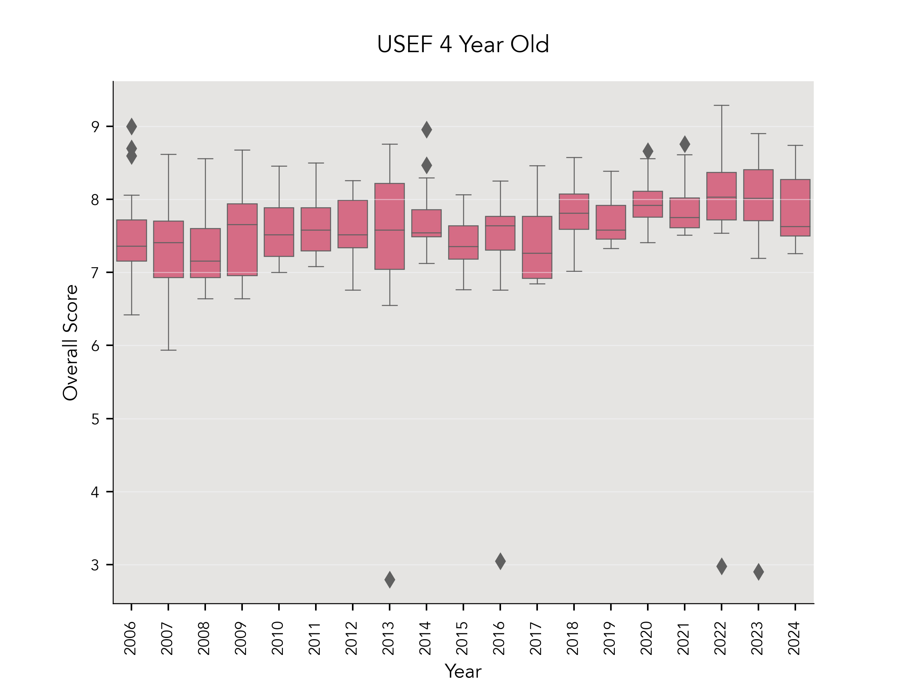
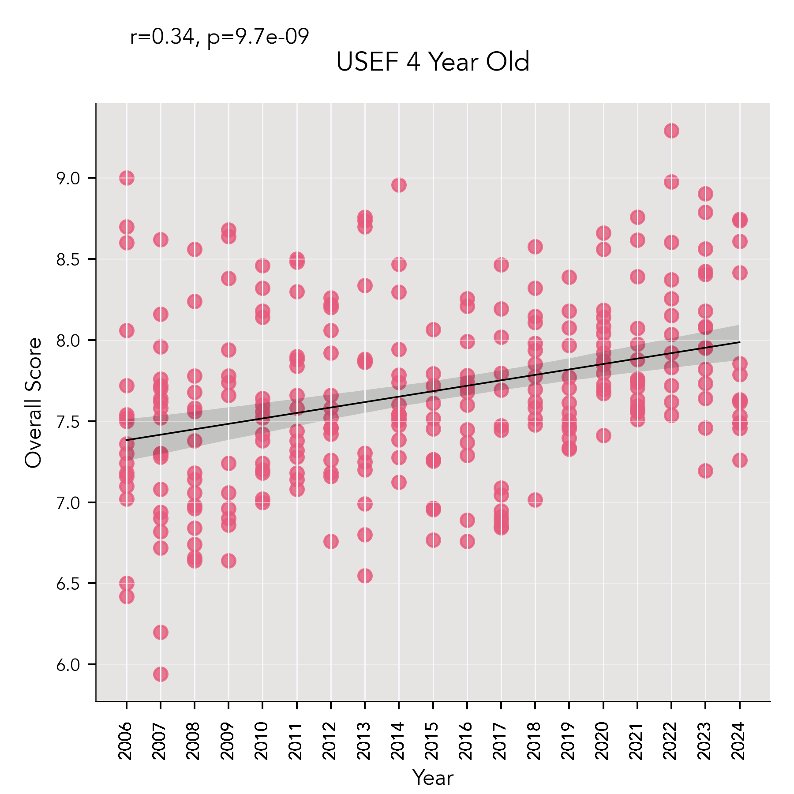
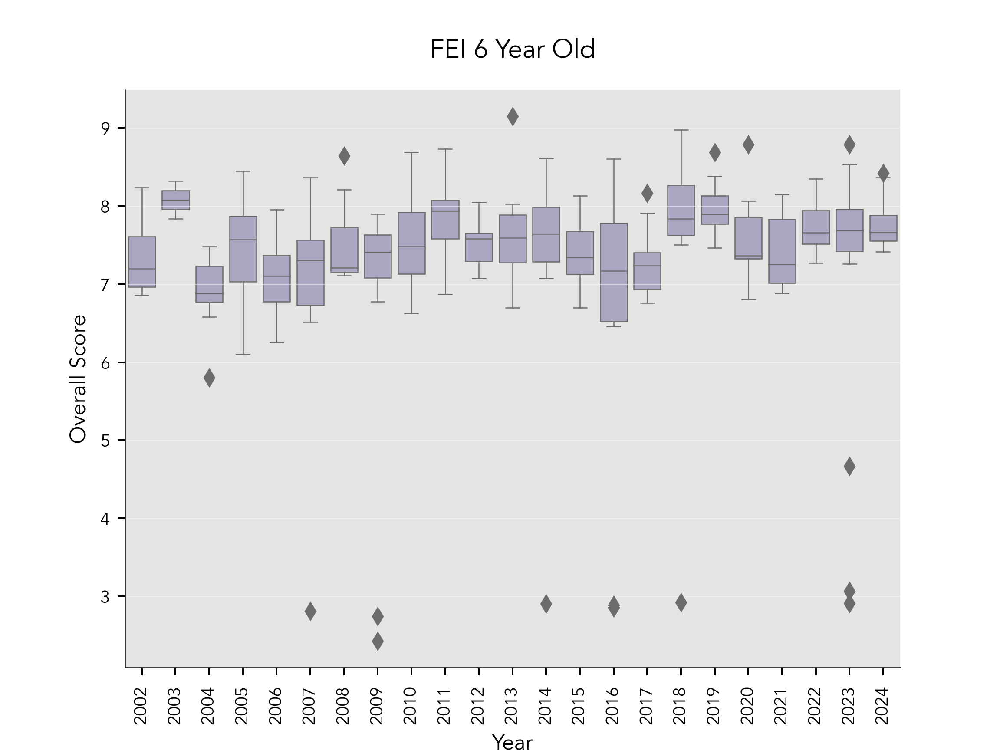
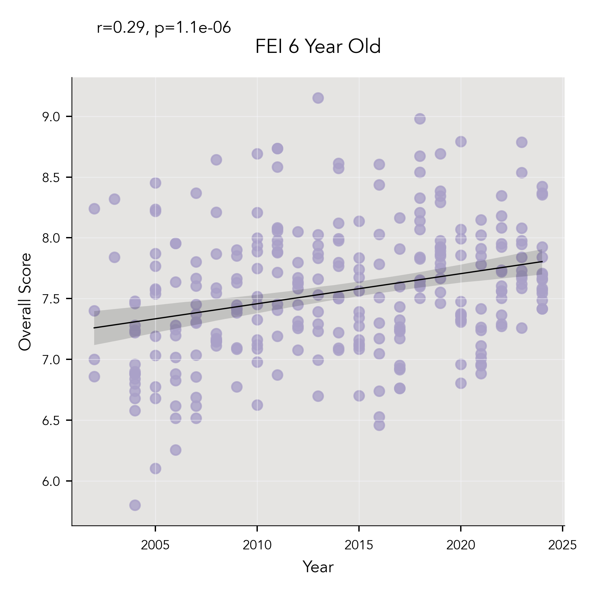
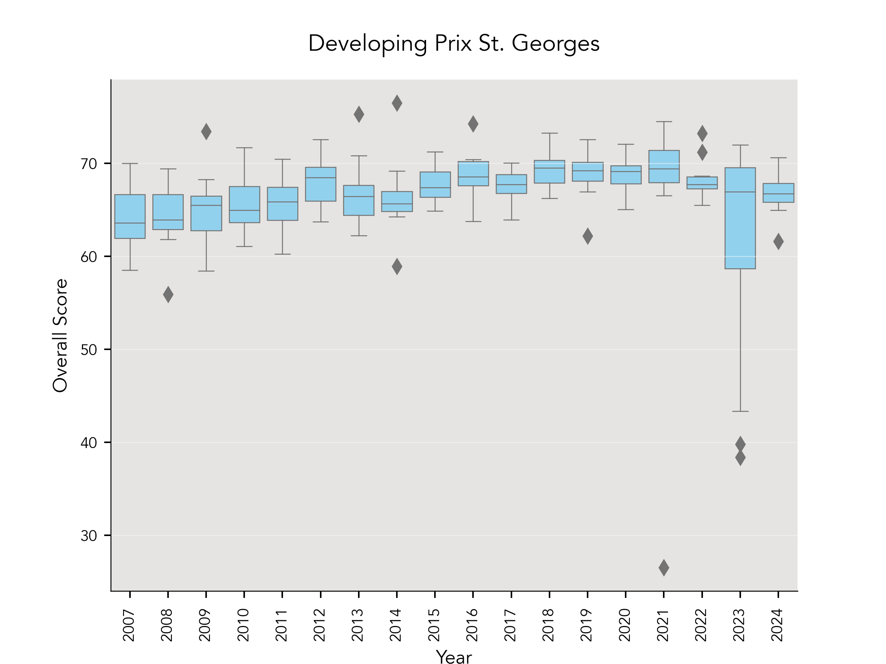
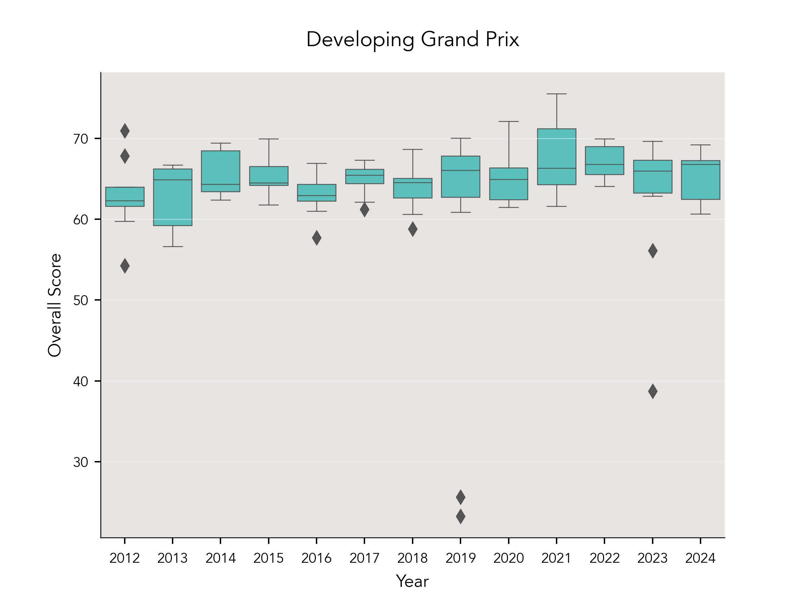
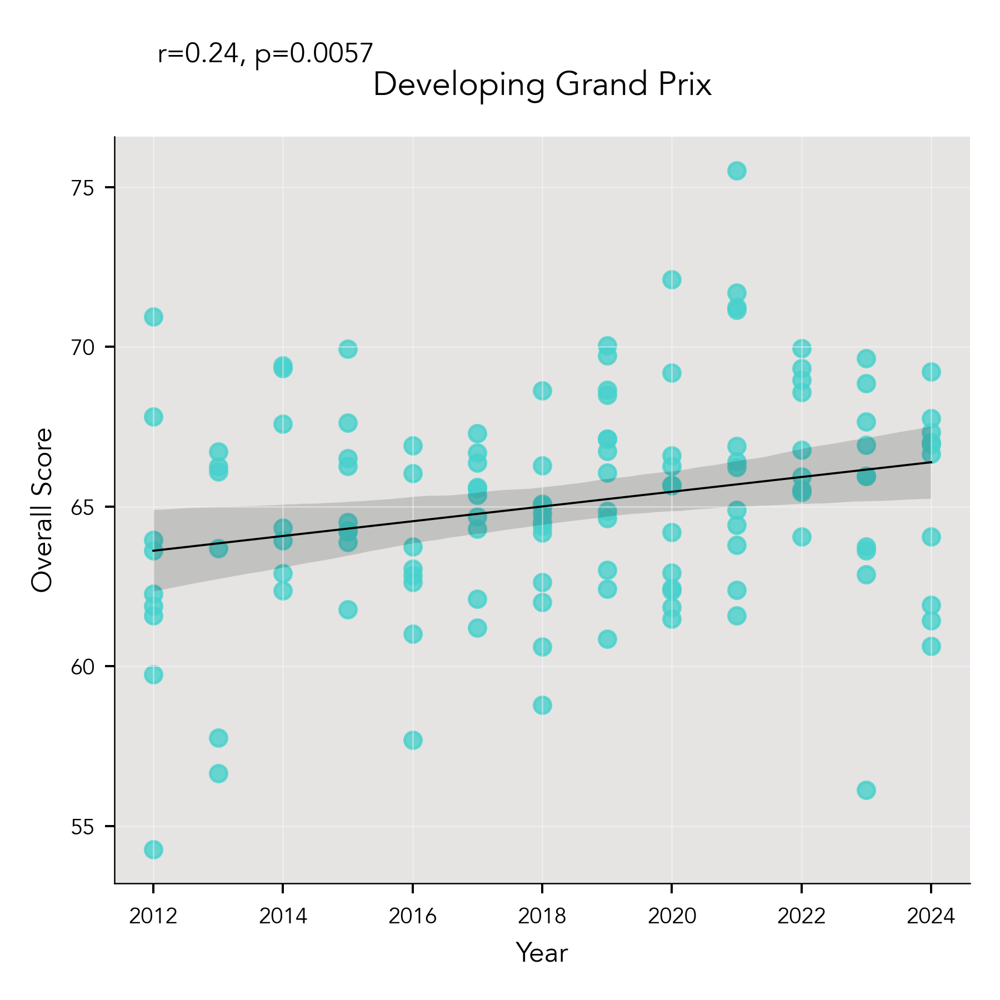

### 2002 - 2024, Overall Scores Analysis
I wanted to look at overall scores over the years, to see if there was a relationship between year and overall score. My hypothesis was that scores would have a positive trend over time, as both breeding and training of horses has improved over the years. I did not include the FEI 7 Year Old division in this analysis, as this division has only been offered since 2022, and therefore does not have many data points, as seen in the summary table below (Table 3).

***Table 3***  
*Summary Statistics for Overall Scores in Championship Divisions* 

| Division   |   Number of Scores |   Mean Score |   Median Score |   Standard Deviation |   Variance |
|:-----------|-------------------:|-------------:|---------------:|---------------------:|-----------:|
| DHGP       |                131 |     64.2769  |        65      |             6.42082  |  41.2269   |
| DHPSG      |                255 |     66.5084  |        67.306  |             5.56945  |  31.0188   |
| FEI5       |                305 |      7.53145 |         7.58   |             0.855057 |   0.731123 |
| FEI6       |                291 |      7.39842 |         7.516  |             0.992308 |   0.984675 |
| FEI7       |                 40 |     70.175   |        70.7785 |             7.70386  |  59.3495   |
| USEF4      |                281 |      7.60641 |         7.62   |             0.791772 |   0.626902 |

The standard deviation for each the Young Horse divisions (4/5/6 Year Olds) is much smaller than that of the Developing Horse divisions, which makes sense given the way the scoring for these tests differs from regular dressage tests. Young Horse tests are scored by giving a numerical score from 1-10 (the score can utilize decimals, e.g. 7.5, 8.2) for the walk, trot, canter, submission, and perspective. The marks are added and then multiplied by 2. The final score is expressed as a number, not a percentage, so the decimal point is moved to the left by one place. [See the FEI 5 Year Old Final test for an example](https://inside.fei.org/system/files/Young%20Horses%205%20YO%20Final%202022.pdf). For instance, a horse given a 8.1 on the walk, 7.5 on the trot, 7.9 on the canter, 7.3 on submission and 7.7 on perspective would receive an overall score of 77, which would be reported as a score of 7.7. Other than the occasional lower score on submission, it is rare for individual scores to be below 6 at the championships. In order to compete at championships, there is a minimum qualifying score (for the 2024 championships, horses must have an overall average of 7.5). So the overall quality of horse, combined with the scoring method, results in very small numbers for both standard deviation and variance. 

In contrast, the Developing Horse tests are scored by movement, and each test has 26-28 individually scored movements. The number of points earned is then used to calculate the final score by percentage, e.g. 66.75%. [See the USEF Developing Prix St. Georges test for an example](https://www.usdf.org/docs/showflash/web/tests/2023/2023%20Developing%20Horse%20Prix%20St%20George.pdf?t=7/8/2024%207:36:58%20PM).

#### Methodology
For each division, my first step was to use a box and whisker plot to visualize the data. I then used Pandas to find the upper and lower quantiles, calculate the IQR, and identify the outliers by finding the upper and lower outlier thresholds. 

After the outliers were identified, I made the decision to drop only the outliers that were artificially low due to missing half of a score. Because the overall score is a weighted calculation (scores are worth 40% on day one, 60% on day two) of scores from two different days, a horse that either got eliminated or had to withdraw from one day will have an artificially low overall score. All other scores were retained. 

I then created a scatterplot from the remaining scores, performed a linear regression on the data, and calculated the Pearson correlation coefficient and *P* value using SciPy. 
 

#### USEF 4 Year Old Scores Analysis
Figure 10 below shows the inital visualization of all data. 

***Figure 10***  
*Box and Whisker Plot for USEF 4 Year Old Division Scores*

From the calculated IQR (6.17-9.12), the outliers were identified (Table 4). 4 of the 6 outliers (all scores below 5.94) were due to the horse completing only one half of the competition, and were dropped. The remainder were retained.  Linear regression (Figure 11) was performed on the remaining data. There was a weak positive correlation between year and overall score (*r*(275)=.34, *p*<.001). 

***Table 4***  
*Outliers for USEF 4 Year Old Division Scores*

|   Year | Division   |   OverallScore |
|-------:|-----------:|:---------------|
|   2007 | USEF4      |          5.94  |
|   2013 | USEF4      |          2.792 |
|   2016 | USEF4      |          3.048 |
|   2022 | USEF4      |          9.292 |
|   2022 | USEF4      |          2.976 |
|   2023 | USEF4      |          2.904 |

***Figure 11***  
*Scatterplot and Linear Regression for USEF 4 Year Old Division Scores*

#### FEI 5 Year Old Scores Analysis
Figure 12 below shows the inital visualization of all data.

***Figure 12***  
*Box and Whisker Plot for FEI 5 Year Old Division Scores*

From the calculated IQR (6.23-8.92), the outliers were identified (Table 5). 7 of the 15 outliers (all scores below 5.94) were due to the horse completing only one half of the competition, and were dropped. The remainder were retained. Linear regression (Figure 13) was performed on the remaining data. There was a weak positive correlation between year and overall score (*r*(294)=.23, *p*<.001). 

***Table 5***  
*Outliers for FEI 5 Year Old Division Scores*

|   Year | Division   |   OverallScore |
|-------:|-----------:|:---------------|
|   2004 | FEI5       |          9.14  |
|   2004 | FEI5       |          6.22  |
|   2004 | FEI5       |          5.94  |
|   2010 | FEI5       |          4.56  |
|   2011 | FEI5       |          3.112 |
|   2013 | FEI5       |          9.012 |
|   2017 | FEI5       |          2.904 |
|   2019 | FEI5       |          9.056 |
|   2019 | FEI5       |          3.016 |
|   2020 | FEI5       |          2.944 |
|   2021 | FEI5       |          9.518 |
|   2021 | FEI5       |          8.964 |
|   2022 | FEI5       |          9.248 |
|   2023 | FEI5       |          3.432 |
|   2023 | FEI5       |          3.144 |

***Figure 13***  
*Scatterplot and Linear Regression for FEI 5 Year Old Division Scores*

#### FEI 6 Year Old Scores Analysis
Figure 14 below shows the inital visualization of all data.

***Figure 14***  
*Box and Whisker Plot for FEI 6 Year Old Division Scores*

From the calculated IQR (6.03-9), the outliers were identified (Table 6). 10 of the 12 outliers (all scores below 5.8) were due to the horse completing only one half of the competition, and were dropped. The remainder were retained. Linear regression (Figure 15) was performed on the remaining data. There was a weak positive correlation between year and overall score (*r*(279)=.29, *p*<.001). 

***Table 6***  
*Outliers for FEI 6 Year Old Division Scores*

|    Year| Division   |   OverallScore |
|-------:|-----------:|:---------------|
|   2004 | FEI6       |          5.8   |
|   2007 | FEI6       |          2.808 |
|   2009 | FEI6       |          2.744 |
|   2009 | FEI6       |          2.424 |
|   2013 | FEI6       |          9.152 |
|   2014 | FEI6       |          2.904 |
|   2016 | FEI6       |          2.888 |
|   2016 | FEI6       |          2.856 |
|   2018 | FEI6       |          2.92  |
|   2023 | FEI6       |          4.668 |
|   2023 | FEI6       |          3.064 |
|   2023 | FEI6       |          2.912 |

***Figure 15***  
*Scatterplot and Linear Regression for FEI 6 Year Old Division Scores*

#### Young Horse Division Scores - Analysis Findings
All three Young Horse divisions (USEF 4 Year Old, FEI 5 and 6 Year Old) showed a weak correlation coefficient, and a very low *P* (*p*<.001 across all divisions). 

While the correlation coefficients are weak across the board, I would argue that this does not mean that the relationship between year and score is insignificant. The scoring system for these tests results in scores that are very tightly clustered—overall scores below 7.0 and above 7.9 are uncommon. There is clearly a relationship between year and overall score, which is for sure multifactorial. Breeders are breeding horses of higher quality, riding and training has improved, and judges have more experience and education in judging these tests. All of these things likely play a role in the positive relationship between year and overall score. 

#### Developing Prix St. Georges Scores Analysis
Figure 16 below shows the inital visualization of all data.

***Figure 16***  
*Box and Whisker Plot for Developing Prix St. Georges Division Scores*

From the calculated IQR (58.69-75.62), the outliers were identified (Table 7). 5 of the 8 outliers (all scores below 55%) were due to the horse completing only one half of the competition, and were dropped.  Linear regression (Figure 17) was performed on the rest of the data. There was a moderate positive correlation between year and overall score (*r*(248)=.45, *p*<.001).

***Table 7***  
*Outliers for Developing Prix St. Georges Division Scores*

|   Year | Division   |   OverallScore |
|-------:|-----------:|:---------------|
|   2008 | DHPSG      |         55.913 |
|   2009 | DHPSG      |         58.45  |
|   2014 | DHPSG      |         76.515 |
|   2021 | DHPSG      |         26.509 |
|   2021 | DHPSG      |         26.49  |
|   2023 | DHPSG      |         43.333 |
|   2023 | DHPSG      |         39.778 |
|   2023 | DHPSG      |         38.361 |

***Figure 17***  
*Scatterplot and Linear Regression for Developing Prix St. Georges Division Scores*

#### Developing Grand Prix Scores Analysis
Figure 18 below shows the inital visualization of all data.

***Figure 18***  
*Box and Whisker Plot for Developing Grand Prix Division Scores*

From the calculated IQR (56.44-73.23), the outliers were identified (Table 8). 3 of the 7 outliers (all scores below 54%) were due to the horse completing only one half of the competition, and were dropped.  Linear regression (Figure 19) was performed on the rest of the data. There was a weak positive correlation between year and overall score (*r*(126)=.24, *p*=.005).

***Table 8***  
*Outliers for Developing Grand Prix Division Scores*

|   Year | Division   |   OverallScore |
|-------:|:-----------|:---------------|
|   2012 | DHGP       |         54.271 |
|   2013 | DHGP       |         56.649 |
|   2019 | DHGP       |         25.666 |
|   2019 | DHGP       |         23.254 |
|   2021 | DHGP       |         75.519 |
|   2023 | DHGP       |         56.128 |
|   2023 | DHGP       |         38.75  |

***Figure 19***  
*Scatterplot and Linear Regression for Developing Grand Prix Division Scores*

#### Developing Horse Division Scores - Analysis Findings